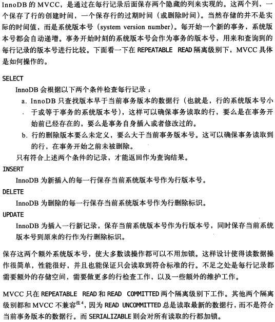

[toc]

# 概述
- MySQL 中 `InnoDB` 引擎支持 `MVCC`
- 应对高并发事务, `MVCC` 比单纯的加行锁更有效, 开销更小
- MVCC 在读已提交（`Read Committed`）和可重复读（`Repeatable Read`）隔离级别下起作用
- `MVCC` 既可以基于乐观锁又可以基于悲观锁来实现

# 隐藏ID
两列隐藏ID：

1. DATA_TRX_ID：记录最近更新这条行记录的事务 ID，大小为`6`个字节
2. DATA_ROLL_PTR：表示指向该行回滚段（`rollback segment`）的指针，大小为 `7` 个字节，InnoDB 便是通过这个指针找到之前版本的数据。该行记录上所有旧版本，**在 undo 中都通过链表的形式组织**。
3. DB_ROW_ID：行标识（隐藏单调自增 ID），大小为 `6` 字节，如果表没有主键，InnoDB 会自动生成一个隐藏主键，因此会出现这个列。另外，每条记录的头信息（record header）里都有一个专门的 bit（deleted_flag）来表示当前记录是否已经被删除。

【update操作的ID变化】

1. 对主键id=XX的记录加排它锁
2. 将该行拷贝到undo log中
3. 修改该行的值，并更新`DATA_TRX_ID`为当前事务的id，将`DATA_ROLL_PTR`指向刚才的旧版本记录（如果对同一行记录执行连续的 UPDATE，Undo Log 会组成一个链表，遍历这个链表可以看到这条记录的变迁）
4. 记录`redo log`，包括`undo log`的修改

- insert：插入一条新记录，并更新`DATA_TRX_ID`为当前事务的id
- delete：与update一致

# 一致性读-ReadView
> 实际的读数据环节，事务都会生成一张ReadView来保障不同的隔离级别（RC和RR）

## RR下的ReadView
> 每个事务开始时(本质是执行第一个select时)会生成ReadView，后续所有的select都会使用该ReadView

## RC下的ReadView
> 每条select语句都会**根据所有活跃事务列表**生成ReadView

ReadView 中是当前活跃的事务 ID 列表，称之为`m_ids`，其中最小值为`up_limit_id`，最大值为`low_limit_id`，事务`ID`是事务开启时`InnoDB`分配的，其大小决定了事务开启的先后顺序.

1. 如果被访问版本的`trx_id`(事务id)小于`m_ids`的最小值`up_limit_id`，则代表被访问版本是当前事务之前产生的，可以被当前事务访问
2. 如果被访问版本的`trx_id`(事务id)大于`m_ids`的最大值`low_limit_id`，则代表被访问版本是当前事务之后产生的，不可以被当前事务访问。需要根据`Undo Log`链找到前一个版本（**即被访问版本修改之前的版本**），然后根据该版本的 DB_TRX_ID 重新判断可见性。
3. 如果被访问版本的`trx_id`(事务id)介于`m_ids`之间，则判断是否在`m_ids`列表中
    1. 在：说明被访问版本的事务还是活跃的，尚未提交，则需要找到该版本的上一个版本数据（即保障读不到未提交的数据）
    2. 不在：说明被访问版本的事务已经被提交，则可以正常被访问
4. 判断可访问的事务的`delete_flag`是否为true，如果是则该条数据已经被删除，则不返回，反之直接返回

注：事务活跃指的是当前事务尚在执行，还没有提交

# FYI

- [MySQL InnoDB MVCC 机制的原理及实现](https://zhuanlan.zhihu.com/p/64576887)

