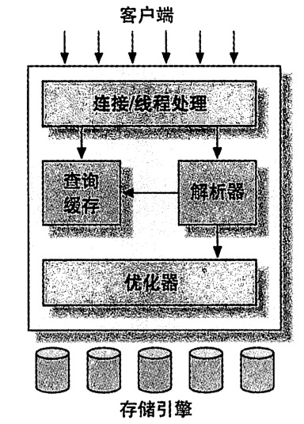
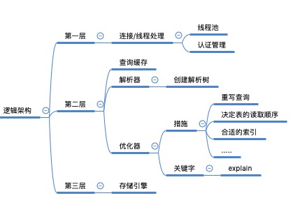
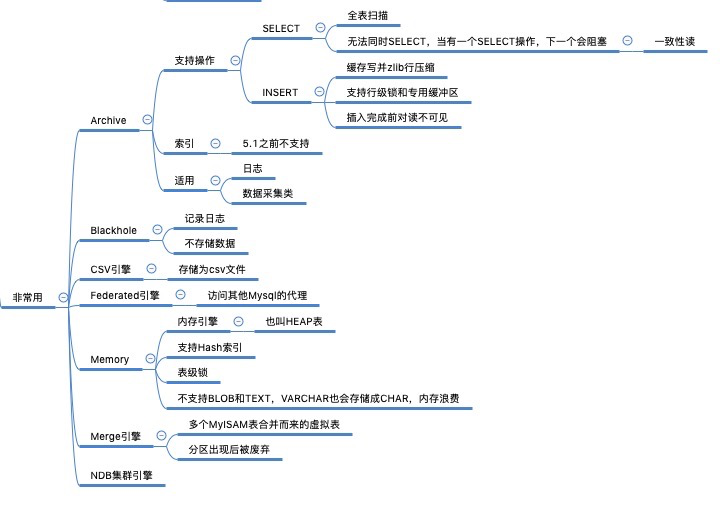

[TOC]
# Mysql逻辑架构

Mysql逻辑架构共三层：

1. 入口层：连接/线程处理
2. 服务执行层
3. 存储引擎

## 连接/线程处理
像大多数架构来说，入口层是必不可少的；Mysql入口层主要负责连接管理和认证及权限管理等。

- 连接管理：每个连接拥有一个线程，Mysql服务端维护了一个维护连接的线程池
- 认证管理：基于用户名、原始主机信息和密码；如果使用了SSL连接，还可以使用X.509证书认证
- 权限管理：Mysql对库、表及操作权限都可以进行约束管理

## 服务执行层
执行层主要包含以下组件：

- 查询缓存：像大多数架构中的redis
- 解析器：词法分析和语法分析，创建一个解析树(内部的数据结构)
- 优化器：主要做的就是重写查询、决定表的读取顺序、选择合适的索引等工作。

## 存储引擎
Mysql有以下存储引擎：

- InnoDB（默认）
- MyISAM
- 其他非常用引擎
    - Archive
    - Blackhole
    - CSV引擎
    - Federated引擎
    - Memory引擎
    - Merge引擎
    - NDB集群引擎

### InnoDB

- 数据存储：表空间，由一系列的数据文件组成。存储文件是平台独立的，可以任意复制到各操作系统
- 事务：支持MVCC和实现了间隙锁来防止幻读
- 索引：基于聚簇索引(主键索引)实现。二级索引(非主键索引)都是包含了主键索引的
- 性能优化措施：
    - 磁盘预读
    - 加速读操作的自适应哈希索引
    - 插入缓冲区(insert buffer)

### MyISAM

【功能】
- 支持：全文索引、压缩、空间函数(GIS)
- 不支持：事务、行级锁、崩溃后无法安全恢复

【存储】
- 文件：数据文件(.MYD)和索引文件(.MYI)
- 变长行处理：
    1. 5.0以前：默认能处理4G的数据，指针长度为4个字节，32位
    2. 5.0：默认能处理256TB的数据，因为指针长度为6个字节
    3. 所有版本都支持8字节，根据配置项`MAX_ROW`和`MAX_ROW_LENGTH`配置，两者相乘得到最终值
    

【特性】
- 加锁与并发：表级锁和并发插入(读时可写)
- 修复：
    1. 人工修复：CHECK TABLE mytable和REPAIR TABKE mytable语句
    2. 自动修复：myisamchk命令行
- 索引特性：全文索引（基于分词创建），对于BLOB和TEXT，会基于前500个字符创建索引
- 延迟更新索引键(Delayed Key Write)：建表时开启DELAY_KEY_WRITE。修改先写入键缓冲区，等清理缓冲区或关闭表时才会更新索引
- 压缩表：压缩后不可修改，表记录独立压缩

### 其他非常用引擎

