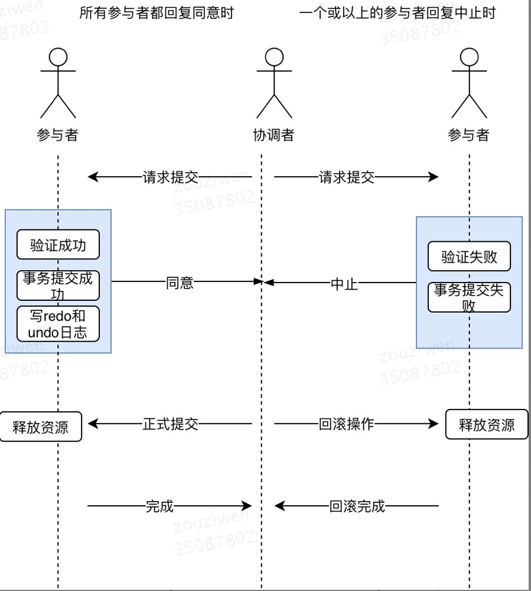
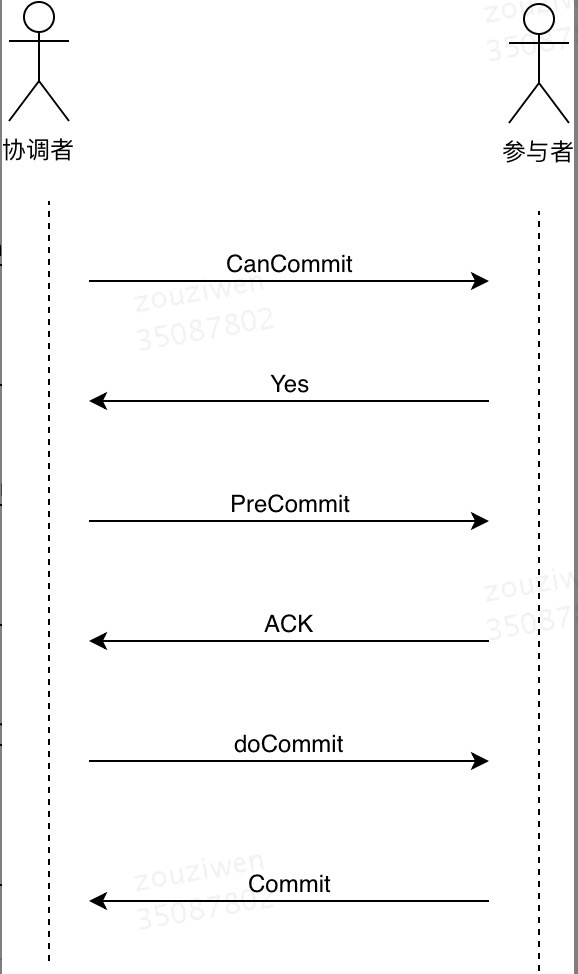

# 2PC
> 二阶段提交（Two-phaseCommit）算法思路：参与者将操作成败通知协调者，再由协调者根据所有参与者的反馈情报决定各参与者是否要提交操作还是中止操作。

两个阶段指的是
- 第一阶段：准备阶段（投票阶段）
- 第二阶段：提交阶段（执行阶段）

## 过程


## 准备阶段
1. 协调者向参与者发起请求提交操作（vote），并等待响应
2. 参与者要么直接返回失败（可能是权限认证失败，事务执行失败等），返回`中止`消息；要么执行事务操作，写Undo信息和Redo信息，不提交，返回`同意`消息

## 提交阶段

（1）所有参与者都返回`同意`消息
1. 协调者向所有参与者发起`正式提交`的请求
2. 参与者节点完成事务，且释放占用的资源；并向协调者发送`完成`消息
3. 协调者收到`完成`消息后，完成事务

（2）存在一个或以上的参与者返回`中止`消息
1. 协调者向所有参与者发起`回滚操作`的请求
2. 参与者执行Undo信息操作，并释放占用的资源；并向协调者发送`回滚完成`消息
3. 协调者收到`回滚完成`消息后，取消事务

## 缺点

1. **同步阻塞问题**。执行过程中，所有参与节点都是事务阻塞型的。当参与者占有公共资源时，其他第三方节点访问公共资源不得不处于阻塞状态。
2. **单点故障**。由于协调者的重要性，一旦协调者发生故障。参与者会一直阻塞下去。尤其在第二阶段，协调者发生故障，那么所有的参与者还都处于锁定事务资源的状态中，而无法继续完成事务操作。（如果是协调者挂掉，可以重新选举一个协调者，但是无法解决因为协调者宕机导致的参与者处于阻塞状态的问题）
3. **数据不一致**。在二阶段提交的阶段二中，当协调者向参与者发送commit请求之后，发生了局部网络异常或者在发送commit请求过程中协调者发生了故障，这回导致只有一部分参与者接受到了commit请求。而在这部分参与者接到commit请求之后就会执行commit操作。但是其他部分未接到commit请求的机器则无法执行事务提交。于是整个分布式系统便出现了数据部一致性的现象。
4. **二阶段无法解决的问题**：协调者再发出commit消息之后宕机，而唯一接收到这条消息的参与者同时也宕机了。那么即使协调者通过选举协议产生了新的协调者，这条事务的状态也是不确定的，没人知道事务是否被已经提交。

# 3PC
> 三阶段提交（Three-phase commit），也叫三阶段提交协议（Three-phase commit protocol），是二阶段提交(2PC)的改进版本

在2PC上的改动点

```
1、引入超时机制。同时在协调者和参与者中都引入超时机制
2、在第一阶段和第二阶段插入一个准备阶段。保证了在最后提交阶段之前各参与节点的状态是一致的
```

三个阶段：
1. CanCommit
2. PreCommit
3. DoCommit

## 过程


## CanCommit阶段
1. 事务询问：协调者向所有参与者发送CanCommit请求，等待响应
2. 响应反馈：参与者根据自身是否可以顺利执行事务，可以则返回yes，反之返回no

## PreCommit阶段
（1）假如协调者从所有的参与者获得的反馈都是Yes响应，那么就会执行事务的预执行。
1. **发送预提交请求**：协调者向参与者发送PreCommit请求，并进入Prepared阶段
2. **事务预提交**：参与者接收到请求后执行事务操作，并将undo和redo信息记录日志
3. **响应反馈**：参与者事务执行成功，返回ACK响应，并开始等待最终指令

（2）假如有任何一个参与者向协调者发送了No响应，或者等待超时之后，协调者都没有接到参与者的响应，那么就执行事务的中断。

1. **发送中断请求**：协调者向所有参与者发送abort请求

2. **中断事务**：参与者收到abort请求后（或超时后，仍未收到协调者的请求），执行事务中断

## doCommit阶段

（1）执行提交

1. **发送提交请求**：协调者接收到所有参与者的ACK请求后，进入提交状态，向参与者发送doCommit请求
2. **事务提交**：参与者接收到doCommit请求后，执行事务提交，并释放资源
3. **响应反馈**：事务提交完成，向协调者回复ACK
4. **完成事务**：协调者接收到所有的ACK后，完成事务   
    - 疑问：存在参与者无回复ACK时，那会是什么情况？

（2）中断事务，协调者没有接收到参与者发送的ACK响应（可能是接受者发送的不是ACK响应，也可能响应超时），那么就会执行中断事务。

1. **发送中断请求**：协调者向所有参与者发送abort请求
2. **事务回滚**：参与者接收abort请求后，使用undo信息执行事务回滚，并释放资源
3. **反馈结果**：事务回滚后向协调者回复ACK
4. **中断事务**：协调者接收到所有的ACK后，执行事务中断
```
在doCommit阶段，如果参与者无法及时接收到来自协调者的doCommit或者rebort请求时，会在等待超时之后，会继续进行事务的提交。
（其实这个应该是基于概率来决定的，当进入第三阶段时，说明参与者在第二阶段已经收到了PreCommit请求，那么协调者产生PreCommit请求的前提条件是他在第二阶段开始之前，
收到所有参与者的CanCommit响应都是Yes。（一旦参与者收到了PreCommit，意味他知道大家其实都同意修改了）所以，一句话概括就是，当进入第三阶段时，由于网络超时等原因，
虽然参与者没有收到commit或者abort响应，但是他有理由相信：成功提交的几率很大。 ）
```

# 2PC和3PC区别

3PC主要在2PC的基础上解决了单点故障问题，其在没接收到协调者信息之后，会默认执行commit；而不会一直持有事务资源并处于阻塞状态。但是会导致一致性问题。

# FYI
- [关于分布式事务、两阶段提交协议、三阶提交协议](http://www.hollischuang.com/archives/681)

