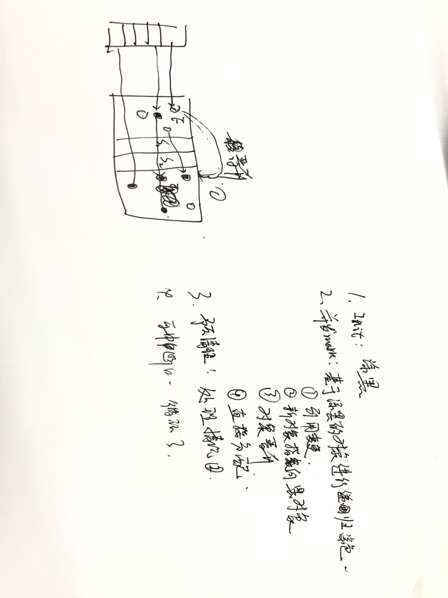

# 设计目标

老年代GC缩短时间

# 触发时机
1. 如果没有设置-XX:+UseCMSInitiatingOccupancyOnly，虚拟机会根据收集的数据决定是否触发（建议线上环境带上这个参数，不然会加大问题排查的难度）。
2. 老年代使用率达到阈值 `CMSInitiatingOccupancyFraction`，默认92%。
3. 永久代的使用率达到阈值 `CMSInitiatingPermOccupancyFraction`，默认92%，前提是开启 `CMSClassUnloadingEnabled`。
4. 新生代的晋升担保失败。

# 过程

CMS将老年代划分为`Card Table`，每个Card大小为512bytes，如果引用发生变化则会将Card标记为`Dirty Card`

基于三色标记算法
1. 白色：尚未标记的对象
2. 灰色：正在被标记中的对象，子对象尚未被标记
3. 黑色：已经被标记过的对象，子对象也完成标记

详细过程：
1、 `Initial Mark`（初始标记）
涂黑；从GC Roots遍历标记存活对象，从新生代标记可达的老年对象

2、`Concurrent Mark`（并发标记）
基于1阶段标记的对象继续多线程递归标记，该过程可能有以下变化：
- 新对象指向老年代对象，或老年代指向新生代对象
- 老年代对象引用变更
- 新生代对象晋升至老年代
- 对象直接分配在老年代

3、`Concurrent Preclean`（预清理）
通过参数`CMSPrecleaningEnabled`选择关闭该阶段，默认启用，主要做两件事情：
- 处理新对象指向老年代对象的情况
- 重新标记在并发标记阶段引用被更新的对象(晋升的新对象)

问题点：
1. `dirty card`的结构？
2. 存储了哪些对象？

4、`Concurrent Abortable Preclean`（可中断的预清理）
前提条件：新生代Eden区的内存使用量大于参数`CMSScheduleRemarkEdenSizeThreshold` 默认是2M

存在的价值：CMS设计的目标是避免老年代GC长时间的暂停，所以能提前并发处理更多的标记，减少后面的暂停时间

主要循环做两件事情：

1. 处理`From`和`To`区的对象，标记可达的老年代对象
2. 扫描处理`Dirty Card`的对象

中断条件：

1. 循环次数：`CMSMaxAbortablePrecleanLoops`，默认为0(没有循环次数的限制)
2. 时间：`CMSMaxAbortablePrecleanTime`，默认5s
3. 新生代内存使用率：`CMSScheduleRemarkEdenPenetration`，默认为50%（这个条件能够成立的前提是，在进行Precleaning时，Eden区的使用率小于十分之一）

5、`Final Remark`（最终标记）
停顿处理并发标记未完成的部分：

1. 遍历新生代对象，重新标记
2. 根据GC Roots，重新标记
3. 遍历老年代的Dirty Card，重新标记，这里的Dirty Card大部分已经在clean阶段处理过

如果新生代对象很多，则耗时会很长；而且可能还引用老年代对象，遍历递归的次数增加

`CMSScavengeBeforeRemark`参数：默认不开启，强制在阶段4触发YGC

6、`Concurrent Sweet`（并发清理）
这阶段主要是清除对象：

1. 移除无用对象
2. 不可达对象分配到freelist

7、`Concurrent Reset`（重置堆大小）

# 问题

1. 性能问题：CMS默认的回收线程数是(CPU个数+3)/4。当CPU为2时，GC线程占用了系统50%的CPU
2. 浮动垃圾：并发清理阶段会产生新的垃圾，只能等到下次清理。所以必须预留内存空间给用户线程使用，由参数`CMSInitiatingOccupancyFraction`控制，默认为92%；如果太小则会导致频繁CMS GC，如果太大就会导致空间不足，产生`Concurrent  Mode Failure`错误
3. 碎片化：标记-清除算法导致大量的内存碎片，给大对象分配带来麻烦(老年代剩余很大，但是由于chunk很小，不足以容纳大对象，只能触发GC)。
    1. `UseCMSCompactAtFullCollection`：在顶不住要Full GC时开启内存碎片整理【停顿时间变长】
    2. `CMSFullGCsBeforeCompaction`：执行多次的不压缩后执行压缩(默认为0，每次都整理)

# FYI

- [图解CMS垃圾回收机制，你值得拥有](https://www.jianshu.com/p/2a1b2f17d3e4)
- [详解CMS垃圾回收机制](https://www.cnblogs.com/littleLord/p/5380624.html)
- [JVM之卡表（Card Table）](https://juejin.im/post/5c39920b6fb9a049e82bbf94)