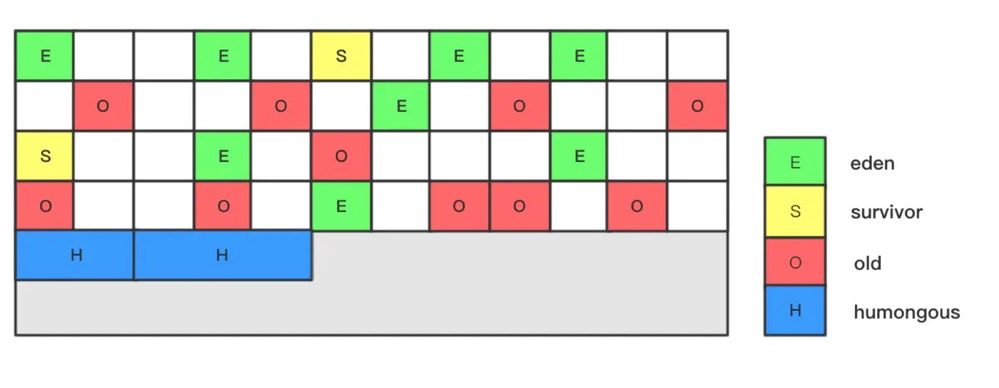

# 设计目标

> 适应不断扩大的内存和不断增加的处理器数量，进一步降低GC暂停时间，同时兼顾良好的吞吐量

与CMS的对比：

| 功能 | CMS | G1 |
| --- | --- | --- |
| 算法 | 标记-清除 | 标记-整理 |
| 内存模型 | 物理分代 | 逻辑分代，采用Region分块 |

重要特性：

- 软实时：指定垃圾回收时间的限时

# 数据结构

- `Region`：[Hotspot]将堆划分成若干个Region(2048)，每个Region大小在1-32MB之间；根据`bump-the-pointer`即一个top指针来区分分配与未分配的范围
    - E:Eden
    - O:Old
    - S:Survivor
    - Humongous：大对象；当对象超过了某个阈值被标记，Hotspot默认是Region的1/2
- `Card Table`：
    - Region划分为若干个512 Byte的Card
    - 全局卡片表(Global Card Table)[RSet]
- `RSet`：每一张卡，都用一个Byte来记录是否修改过。卡表即这些byte的集合。
    - 在RS的修改上也会遇到并发的问题。因为一个Region可能有多个线程在并发修改，因此它们也会并发修改RS。为了避免这样一种冲突，G1垃圾回收器进一步把RS划分成了多个哈希表。每一个线程都在各自的哈希表里面修改。




# 各区域大小

1. 堆空间：由`-Xms`（初始空间）和`-Xmx`（最大空间）控制
   1. 年轻代：`-Xmn`设置年轻代大小（同时设置-XX:newSize和-XX：MaxNewSize）
      1. `Eden`区：在初始空间`-XX:G1NewSizePercent`(默认整堆5%)和最大空间`-XX:G1MaxNewSizePercent`(默认60%)之间动态变化，且由参数目标暂停时间`-XX:MaxGCPauseMillis`(默认200ms)、需要扩缩容的大小以及分区的已记忆集合(RSet)计算得到。
      2. `Survivors`区：有两个S区，一般每个S区是年轻代的1/10；当然也可以通过参数`‐XX:SurvivorRatio`来控制
   2. 老年代`old`区：-Xmx - eden - survivors
   
2. 堆外空间：
  
   1. `Metaspace`区：元空间，由参数`-XX:MetaspaceSize`和`-XX:MaxMetaspaceSize`控制
   
3. Region大小：可根据`-XX:G1HeapRegionSize`设置，如果不设置则计算公式为
   $$
   average\_heap\_size = \frac{Xmx + Xms}{2}  \\
   region\_size = max ( \frac{average\_heap\_size}{2048} , 1 )
   $$
   

# 参数

参数-XX:GCTimeRatio表示GC与应用耗费时间比，G1中默认为9，计算方式为_gc_overhead_perc = 100.0x(1.0/(1.0+GCTimeRatio)),即G1 GC时间与应用时间占比不超过10%时不需要动态拓展。


G1是一个响应优先的GC算法，用户可以设定期望停顿时间由参数MaxGCPauseMills控制，默认值为200ms。
G1会在这个目标停顿时间内完成垃圾回收的工作。

G1使用停顿预测模型来满足期望，预测逻辑基于衰减平均值和衰减标准差。

# 触发时机

1. `youngGC`：活跃对象拷贝到S区或老年代，空闲Region加入空闲列表
    - eden region被耗尽，无法申请到资源时
2. `mixedGC`：回收整个Eden区及部分Old区
    - 当YGC后空间还不足分配时
    - 当老年代大小占整个堆的百分比
3. `FullGC`：单线程执行的serial old gc
    - mixedGC来不及回收，导致老年代被填满


# 并发标记周期过程

1. `Initial marking`：STW，标记从GCRoots可达的对象
2. `Root region scanning `：扫描S区指向老年代被第一阶段标记的引用及引用的对象
    - 为什么要这个阶段；因为RSet不记录从E区出发的指针（E-E，E-O）
3. `Concurrent marking`：标记整个堆的存活对象，以及引用变更的对象（会被SATB的write barrier记录）
4. `Remark`：STW，标记并发标记过程中引用变更的对象及新的存活对象的引用
5. `Cleanup`：清理阶段
    - 计算每一个region中存活对象，region无存活对象加入到空闲列表（STW）
    - 重置RSet

# G1日志

```shell
2020-11-06T10:40:09.610+0800: 51166.248: [GC pause (G1 Evacuation Pause) (young)
Desired survivor size 201326592 bytes, new threshold 15 (max 15)
- age   1:   43237720 bytes,   43237720 total
- age   2:    5328328 bytes,   48566048 total
- age   3:    2049096 bytes,   50615144 total
- age   4:    1135288 bytes,   51750432 total
- age   5:     210072 bytes,   51960504 total
- age   6:     344272 bytes,   52304776 total
- age   7:     102432 bytes,   52407208 total
- age   8:     326736 bytes,   52733944 total
- age   9:     324776 bytes,   53058720 total
- age  10:      48904 bytes,   53107624 total
- age  11:      82392 bytes,   53190016 total
- age  12:      32416 bytes,   53222432 total
- age  13:      82872 bytes,   53305304 total
- age  14:      26440 bytes,   53331744 total
- age  15:      72312 bytes,   53404056 total
 51166.249: [G1Ergonomics (CSet Construction) start choosing CSet, _pending_cards: 7763, predicted base time: 10.20 ms, remaining time: 189.80 ms, target pause time: 200.00 ms]
 51166.249: [G1Ergonomics (CSet Construction) add young regions to CSet, eden: 754 regions, survivors: 14 regions, predicted young region time: 33.51 ms]
 51166.249: [G1Ergonomics (CSet Construction) finish choosing CSet, eden: 754 regions, survivors: 14 regions, old: 0 regions, predicted pause time: 43.70 ms, target pause time: 200.00 ms]
, 0.0375195 secs]
   [Parallel Time: 33.2 ms, GC Workers: 4]
      [GC Worker Start (ms): Min: 51166249.8, Avg: 51166249.8, Max: 51166249.9, Diff: 0.0]
      [Ext Root Scanning (ms): Min: 2.2, Avg: 3.0, Max: 5.0, Diff: 2.8, Sum: 12.0]
      [Update RS (ms): Min: 3.0, Avg: 4.8, Max: 5.4, Diff: 2.4, Sum: 19.2]
         [Processed Buffers: Min: 32, Avg: 60.5, Max: 100, Diff: 68, Sum: 242]
      [Scan RS (ms): Min: 0.2, Avg: 0.2, Max: 0.3, Diff: 0.1, Sum: 0.9]
      [Code Root Scanning (ms): Min: 0.0, Avg: 0.0, Max: 0.0, Diff: 0.0, Sum: 0.0]
      [Object Copy (ms): Min: 24.9, Avg: 25.0, Max: 25.1, Diff: 0.3, Sum: 100.1]
      [Termination (ms): Min: 0.0, Avg: 0.0, Max: 0.0, Diff: 0.0, Sum: 0.0]
      [GC Worker Other (ms): Min: 0.0, Avg: 0.1, Max: 0.1, Diff: 0.1, Sum: 0.3]
      [GC Worker Total (ms): Min: 33.1, Avg: 33.1, Max: 33.2, Diff: 0.0, Sum: 132.6]
      [GC Worker End (ms): Min: 51166283.0, Avg: 51166283.0, Max: 51166283.0, Diff: 0.0]
   [Code Root Fixup: 0.1 ms]
   [Code Root Purge: 0.0 ms]
   [Clear CT: 0.4 ms]
   [Other: 3.7 ms]
      [Choose CSet: 0.0 ms]
      [Ref Proc: 0.3 ms]
      [Ref Enq: 0.0 ms]
      [Redirty Cards: 0.1 ms]
      [Humongous Reclaim: 0.0 ms]
      [Free CSet: 1.5 ms]
   [Eden: 3016.0M(3016.0M)->0.0B(3016.0M) Survivors: 56.0M->56.0M Heap: 3591.8M(5120.0M)->575.9M(5120.0M)]
Heap after GC invocations=1339 (full 0):
 garbage-first heap   total 5242880K, used 589683K [0x0000000680000000, 0x0000000680402800, 0x00000007c0000000)
  region size 4096K, 14 young (57344K), 14 survivors (57344K)
 Metaspace       used 105675K, capacity 109576K, committed 109952K, reserved 1146880K
  class space    used 12209K, capacity 13087K, committed 13184K, reserved 1048576K
}
 [Times: user=0.11 sys=0.02, real=0.04 secs] 
2020-11-06T10:40:09.648+0800: 51166.286: Total time for which application threads were stopped: 0.0407905 seconds, Stopping threads took: 0.0014847 seconds
2020-11-06T10:40:20.042+0800: 51176.680: Total time for which application threads were stopped: 0.0017766 seconds, Stopping threads took: 0.0002226 seconds
2020-11-06T10:40:20.048+0800: 51176.687: Total time for which application threads were stopped: 0.0049653 seconds, Stopping threads took: 0.0000746 seconds
```

***

以下为日志的详解：

```java
2020-11-06T10:40:09.610+0800: 51166.248: [GC pause (G1 Evacuation Pause) (young)
```

1. `2020-11-06T10:40:09.610+0800: 51166.248`：GC事件发生的时间，`51166.248`是JVM启动之后经历的时间
2. `GC pause (G1 Evacuation Pause)(young)`：这个是收集器把存活对象从一个区域拷贝到另一个区域的阶段；且执行的是YoungGC
3. `Full GC (Allocation Failure)`：这说明是Full GC
4. Mixed GC是一个很长的过程，从`initial-mark`开始，直到`G1Ergonomics (Mixed GCs) do not continue mixed GCs`。这期间，可以发生多次GC（因为启动Mixed GC时，可回收内存仅占6%，且中途并没有产生大量的H-OBJ，所以一次回收后，就小于5%的门限。）。


```java
Desired survivor size 201326592 bytes, new threshold 15 (max 15)：
```

1. `max 15`：由`-XX:MaxTenuringThreshole`设置，默认为15
2. `new threshold 15`：当前存活的对象年龄

`-XX:TargetSurvivorRatio`设置了survivor区的目标使用率；如果某个age的对象内存大小大于`desired survivor size`，就会触发gc；
$$
desired survivor size = (survivor区容量 * TargetSurvivorRatio)/100（其实就是survivor容量乘以这个targetSurvivorRatio的比值）
$$


参考[Desired Survivor的疑问和对象晋升老年代的小结](https://blog.csdn.net/gx11251143/article/details/103586655)


【并发收集相关】

```java
[Parallel Time: 33.2 ms, GC Workers: 4]
      [GC Worker Start (ms): Min: 51166249.8, Avg: 51166249.8, Max: 51166249.9, Diff: 0.0]
      [Ext Root Scanning (ms): Min: 2.2, Avg: 3.0, Max: 5.0, Diff: 2.8, Sum: 12.0]
      [Update RS (ms): Min: 3.0, Avg: 4.8, Max: 5.4, Diff: 2.4, Sum: 19.2]
         [Processed Buffers: Min: 32, Avg: 60.5, Max: 100, Diff: 68, Sum: 242]
      [Scan RS (ms): Min: 0.2, Avg: 0.2, Max: 0.3, Diff: 0.1, Sum: 0.9]
      [Code Root Scanning (ms): Min: 0.0, Avg: 0.0, Max: 0.0, Diff: 0.0, Sum: 0.0]
      [Object Copy (ms): Min: 24.9, Avg: 25.0, Max: 25.1, Diff: 0.3, Sum: 100.1]
      [Termination (ms): Min: 0.0, Avg: 0.0, Max: 0.0, Diff: 0.0, Sum: 0.0]
      [GC Worker Other (ms): Min: 0.0, Avg: 0.1, Max: 0.1, Diff: 0.1, Sum: 0.3]
      [GC Worker Total (ms): Min: 33.1, Avg: 33.1, Max: 33.2, Diff: 0.0, Sum: 132.6]
      [GC Worker End (ms): Min: 51166283.0, Avg: 51166283.0, Max: 51166283.0, Diff: 0.0]
   [Code Root Fixup: 0.1 ms]
   [Code Root Purge: 0.0 ms]
   [Clear CT: 0.4 ms]
   [Other: 3.7 ms]
      [Choose CSet: 0.0 ms]
      [Ref Proc: 0.3 ms]
      [Ref Enq: 0.0 ms]
      [Redirty Cards: 0.1 ms]
      [Humongous Reclaim: 0.0 ms]
      [Free CSet: 1.5 ms]
```

1. `[Parallel Time: 33.2 ms, GC Workers: 4]`：并发收集中STW的时间=33.2ms，GC线程=4个
2. `[GC Worker Start (ms): Min: 51166249.8, Avg: 51166249.8, Max: 51166249.9, Diff: 0.0]`：Min=第一个垃圾收集线程开始工作时JVM启动后经过的时间；Max=最后一个工作的时间；Diff=Max-Min，理想情况下两者一致最好
3. ` [Ext Root Scanning (ms): Min: 2.2, Avg: 3.0, Max: 5.0, Diff: 2.8, Sum: 12.0]`：扫描Root集合花费的时间。
4. `[Update RS (ms): Min: 3.0, Avg: 4.8, Max: 5.4, Diff: 2.4, Sum: 19.2]`：每个分区都有自己的RSet，用来记录其他分区指向当前分区的指针，如果RSet有更新，G1中会有一个post-write barrier管理跨分区的引用——新的被引用的card会被标记为dirty，并放入一个日志缓冲区，如果这个日志缓冲区满了会被加入到一个全局的缓冲区，在JVM运行的过程中还有线程在并发处理这个全局日志缓冲区的dirty card。**Update RS**表示允许垃圾收集线程处理本次垃圾收集开始前没有处理好的日志缓冲区，这可以确保当前分区的RSet是最新的。
   1. **Processed Buffers**，这表示在Update RS这个过程中处理多少个日志缓冲区
5. **Scan RS**：扫描每个新生代分区的RSet，找出有多少指向当前分区的引用来自CSet。
6. **Code Root Scanning**：扫描代码中的root节点（局部变量）花费的时间
7. **Object Copy**：在疏散暂停期间，所有在CSet中的分区必须被转移疏散，Object Copy就负责将当前分区中存活的对象拷贝到新的分区。
8. **Termination**：当一个垃圾收集线程完成任务时，它就会进入一个临界区，并尝试帮助其他垃圾线程完成任务（steal outstanding tasks），min表示该垃圾收集线程什么时候尝试terminatie，max表示该垃圾收集回收线程什么时候真正terminated。
   1. **Termination Attempts**：如果一个垃圾收集线程成功盗取了其他线程的任务，那么它会再次盗取更多的任务或再次尝试terminate，每次重新terminate的时候，这个数值就会增加。
9. **GC Worker Other**：垃圾收集线程在完成其他任务的时间
10. **GC Worker Total**：展示每个垃圾收集线程的最小、最大、平均、差值和总共时间。
11. **GC Worker End**：min表示最早结束的垃圾收集线程结束时该JVM启动后的时间；max表示最晚结束的垃圾收集线程结束时该JVM启动后的时间。理想情况下，你希望它们快速结束，并且最好是同一时间结束。

新生代GC的一些任务：

- **Code Root Fixup** ：释放用于管理并行垃圾收集活动的数据结构，应该接近于0，该步骤是线性执行的；
- **Code Root Purge**：清理更多的数据结构，应该很快，耗时接近于0，也是线性执行。
- **Clear CT**：清理card table

还有一些扩展功能：

- **Choose CSet**：选择要进行回收的分区放入CSet（G1选择的标准是垃圾最多的分区优先，也就是存活对象率最低的分区优先）
- **Ref Proc**：处理Java中的各种引用——soft、weak、final、phantom、JNI等等。
- **Ref Enq**：遍历所有的引用，将不能回收的放入pending列表
- **Redirty Card**：在回收过程中被修改的card将会被重置为dirty
- **Humongous Register**：JDK8u60提供了一个特性，巨型对象可以在新生代收集的时候被回收——通过`G1ReclaimDeadHumongousObjectsAtYoungGC`设置，默认为true。
- **Humongous Reclaim**：做下列任务的时间：确保巨型对象可以被回收、释放该巨型对象所占的分区，重置分区类型，并将分区还到free列表，并且更新空闲空间大小。

- **Free CSet**：将要释放的分区还回到free列表。


参考自：[深入理解G1的GC日志（一）](https://juejin.im/post/6844903893906751501)


```java
[Eden: 3016.0M(3016.0M)->0.0B(3016.0M) Survivors: 56.0M->56.0M Heap: 3591.8M(5120.0M)->575.9M(5120.0M)]
```

1. `Eden: 3016.0M(3016.0M)->0.0B(3016.0M)`：回收了eden区3016M；括号中的数据代表eden区的总大小
2. `Survivors: 56.0M->56.0M`：回收前后survivors没有发生变化，eden对象被全部回收；也有可能eden的垃圾与晋升到old区的对象大小一致
3. `Heap: 3591.8M(5120.0M)->575.9M(5120.0M)]`：整个堆5120M，回收前占用3591.8M，回收后占用575.9M（ps：经过GC，young区减少3016M，heap也减少3015.9M，说明此次只有0.1M的对象晋升到老年代）
4. `old`区计算公式：

$$
old增量 = ( 回收前(eden+survivors) - 回收后(eden+survivors)) - (回收前(heap) - 回收后(heap) )
$$


```java
Heap after GC invocations=1339 (full 0):
```

full 0:代表是在第N次full gc周期内；如果是full 1则代表之前执行过一次full gc


```java
 [Times: user=0.11 sys=0.02, real=0.04 secs] 
```

1. `user`：垃圾收集线程在新生代垃圾收集过程中消耗的CPU时间，这个时间跟垃圾收集线程的个数有关，可能会比real time大很多；
2. `sys`：内核态线程消耗的CPU时间
3. `real`：本次垃圾收集真正消耗的时间

主要需要关注下real的时间，说明本次GC收集器花了0.04秒

```java
Total time for which application threads were stopped: 0.0407905 seconds, Stopping threads took: 0.0014847 seconds
```

当GC发生时，每个线程只有进入了SafePoint才算是真正挂起，也就是真正的停顿，这个日志的含义是整个GC过程中STW的时间，配置了 **-XX:+PrintGCApplicationStoppedTime** 这个参数才会打印这个信息。这个值会等于real值，

【为什么会打印多条】

这个次数和gc是没关系的；这个日志主要是记录所有的安全点。G1的并发标记和GC是独立的，在触发标记阶段会引起三次停顿，此时的日志主要记录该阶段


参考：[读懂 GC 日志](https://www.cnblogs.com/43726581Gavin/p/9518411.html)

# 问题

列表：

1. 并发标记和GC是什么关系？什么情况下回触发并发标记
2. eden自动扩缩容的机制

## InitiatingHeapOccupancyPercent参数

参数`XX:InitiatingHeapOccupancyPercent`

如果将这个参数调小，G1就会更早得触发并发垃圾收集周期。这个值需要谨慎设置：如果这个参数设置得太高，会导致FULL GC出现得频繁；如果这个值设置得过小，又会导致G1频繁得进行并发收集，白白浪费CPU资源。通过GC日志可以通过一个点来判断GC是否正常——在一轮并发周期结束后，需要确保堆剩下的空间小于InitiatingHeapOccupancyPercent的值。


# FYI 

- [G1垃圾回收器详解](https://www.jianshu.com/p/aef0f4765098)
- [G1垃圾收集器介绍](https://www.jianshu.com/p/0f1f5adffdc1)
- [可能是最全面的G1学习笔记](https://zhuanlan.zhihu.com/p/54048685)