[TOC]

# Buffer简介
在Java NIO中，主要有三大基本的组件：Buffer、Channel和Selector，上一篇文章我们具体介绍了[Selector](),现在让我们深入理解下在实际编程中使用的最多的Buffer。

## 定义

首先先让我们来认识一下Buffer：

> A container for data of a specific primitive type.
> A buffer is a linear, finite sequence of elements of a specific primitive type

在Buffer类的描述中，Buffer被定义为用于特定基本类型数据的容器，且是特定基本类型的线性优先元素序列。

Buffer提供了一个字节缓冲区，它可以从channels中读取数据到Buffer，也可以将Buffer中的数据写入到channels，所以NIO被定义为面向缓冲区编程，而IO则是被定义为面向流的编程。

## 底层实现
通过阅读源码让我们慢慢揭开Buffer的神秘面纱

```java
public abstract class Buffer {

    /************ 状态变量 ***********/
    // Invariants: mark <= position <= limit <= capacity
    private int mark = -1;
    private int position = 0;
    private int limit;
    private int capacity;
    
    /************ 访问方法 ***********/
    public final Buffer limit(int newLimit);
    public final Buffer mark();
    public final Buffer reset();
    public final Buffer clear();
    public final Buffer flip();
    public final Buffer rewind();
    // 剩余可读元素，limit - position
    public final int remaining();
    // 是否是只可读缓冲区
    public abstract boolean isReadOnly();
    // 是否是堆外内存
    public abstract boolean isDirect();
```

Buffer类一共有四个变量，被称之为状态变量

- capacity：容量，必须初始化的值（因为底层是数组）
- limit：上界，缓冲区的临界区，即最多可读到哪个位置
- position：下标，当前读取到的位置(例如当前读出第5个元素，则读完后，position为6)
- mark：标记，备忘位置

四个状态大小关系

```
0 <= mark <= position <= limit <= capacity
```

通过访问方法我们可以控制变量的指向，来达到读取到我们想要的数据的目的，下面让我们结合源码和图来学习下各方法对缓冲区的操作

```java
ByteBuffer buffer = ByteBuffer.allocate(n);  (1)

buffer.limit(5);    (2)

// 执行get操作会将position加1
buffer.get();
buffer.get();

buffer.mark();      (3)

buffer.get();
buffer.get();

buffer.reset();     (4)

buffer.flip();      (5)

buffer.rewind();    (6)

buffer.reset();     (7)
```

(1)初始化Buffer
一个初始化的Buffer各变量位置指向如图(这里capacity大小为n)：
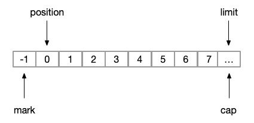

（2）limit
```java
    public final Buffer limit(int newLimit) {
        if ((newLimit > capacity) || (newLimit < 0))
            throw new IllegalArgumentException();
        // 设置limit的新位置
        limit = newLimit;
        // 如果当前读取到位置大于新设置的可读上限，则将position重置为limit，意思是缓存区无法再往下读取了
        if (position > limit) position = limit;
        // 如果mark的位置大于新设置的可读上限，则需要重置mark为-1；代表mark的位置失效了
        if (mark > limit) mark = -1;
        return this;
    }
```
所以如果我们执行`limit(5)`操作，则上图变化为
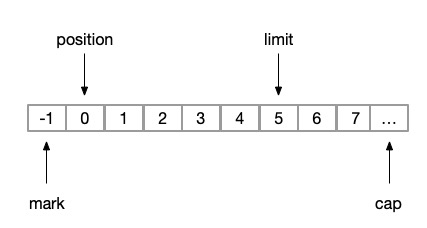

（3）mark
```java
    public final Buffer mark() {
        // 记录当前读到的位置
        mark = position;
        return this;
    }
```
`mark`操作之前Buffer已经被读取到第二个位置(此时`position=2`)，准备要读第三个元素之前，我们执行mark操作后，则图变化为
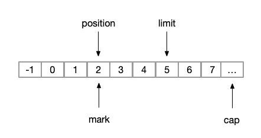

（4）reset
```java
    // mark位置，将postion置为mark
    // 恢复到上次备忘的位置
    public final Buffer reset() {
        int m = mark;
        if (m < 0)
            throw new InvalidMarkException();
        position = m;
        return this;
    }
```
`reset`操作之前，我们执行了两次get操作，所以此时的`position=4`，状态变化为下图
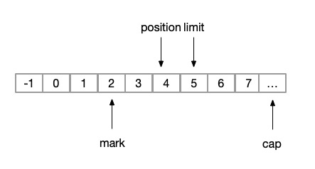
执行`reset`后我们的状态又变为（3）操作


（5）flip
如果我们想重新读取上一次读取的内容，则可以执行`flip`操作
```java
    // 将缓冲区的内容切换为重新读取状态
    public final Buffer flip() {
        limit = position;
        position = 0;
        mark = -1;
        return this;
    }
```
状态变化为
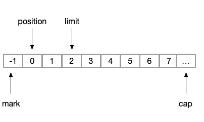

（6）rewind
重读缓冲区操作
```java
    public final Buffer rewind() {
        position = 0;
        mark = -1;
        return this;
    }
```
此时的操作结果与执行flip操作后一致；
但如果我们执行rewind之前不执行flip操作，则在（4）操作后，我们直接执行rewind，则状态变化为
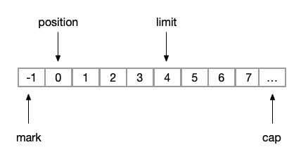

（7）clear
恢复缓冲区至初始状态
```java
    public final Buffer clear() {
        position = 0;
        limit = capacity;
        mark = -1;
        return this;
    }
```
即


通过上面的实例及图讲解相信大家一定对Buffer加深了了解，所以我们再次简单的定义一下Buffer；`Buffer缓冲区其实就是一个线性数组，通过mark、position、limit来控制读取和写入数组`，补充一下Buffer的特性：

- Buffer底层是线性数组，是有限的基本类型元素的组合
- Buffer可以提供一个固定大小的容器来读取和写入数据
- 每个Buffer都是可读的，但只有选中的buffer才可写
- 默认情况下，Buffer不是线程安全的，所以在多线程环境下操作同一个Buffer，一定要使用锁机制保证同步


# Buffer的实现类
上文我们对Buffer已经有了一定的了解，下面让我们来看看它有哪些实现吧；首先我们看看Buffer类结构图
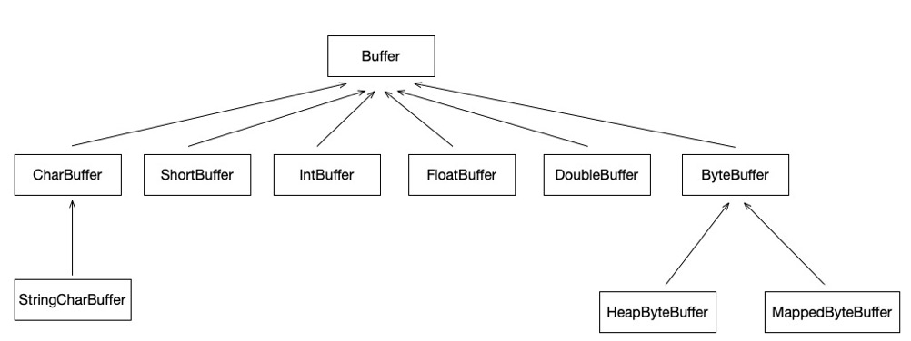
                    
一般的，我们将Buffer分为两类

- ByteBuffer：字节缓冲区，NIO编程中最常用的缓冲区。主要包含两种，HeapByteBuffer和MappedByteBuffer
- 基本类型Buffer：除了boolean类型之外的其他基本数据类型的缓冲区

在实际编程中，我们最常用的就是ByteBuffer，因为在实际IO中也都是通过字节流在交互，所以下面我们将重点讲ByteBuffer,废话不多说，先上源码看看

```java
public abstract class ByteBuffer
    extends Buffer implements Comparable<ByteBuffer>
{
    final byte[] hb;
    // 数组的起始位置
    final int offset;
    
    /**********创建ByteBuffer**********/
    
    // 创建基于堆外内存的ByteBuffer
    public static ByteBuffer allocateDirect(int capacity) {
        return new DirectByteBuffer(capacity);
    }
    
     // 创建基于堆内存的ByteBuffer
    public static ByteBuffer allocate(int capacity) {
        if (capacity < 0)
            throw new IllegalArgumentException();
        return new HeapByteBuffer(capacity, capacity);
    }
    
    
    /**********ByteBuffer的方法(不全，重要的几个)**********/
    
    // 字节序
    // BIG_ENDIAN：最低地址存放最高有效字节
    // LITTLE_ENDIAN：最低地址存放最低有效字节
    // java字节序：JAVA虚拟机中多字节类型数据的存放顺序，JAVA字节序也是BIG-ENDIAN。
    public final ByteOrder order() {
        return bigEndian ? ByteOrder.BIG_ENDIAN : ByteOrder.LITTLE_ENDIAN;
    }
    
    // 读取指定位置的元素
    public abstract byte get(int index);
    
    // 往指定位置写入元素
    public abstract ByteBuffer put(int index, byte b);
    
    // 基于当前状态new一个新的ByteBuffer
    public abstract ByteBuffer duplicate();
    
    // 是否是直接操作内存的Buffer；若是，则此Buffer直接操作JVM堆外内存 ，使用Unsafe实现；否则操作JVM堆内存
    public abstract boolean isDirect();
    
    // 丢弃已经读取的数据，保留未读取的数据，并使缓存中处于待填充状态
    public abstract ByteBuffer compact();
    
    // 从当前buffer中生成一个该buffer尚未使用部分的新的缓冲区，例如当前buffer的position为3，limit为5，则新的缓冲区limit和capacity都为2，offset的3，数据区域两者共享；
    public abstract ByteBuffer slice();
```
从ByteBuffer的源码来看，相比较于Buffer，其新增了几个重要的方法，下面让我们继续以前文的方式来学习下这些方法的作用

```java
ByteBuffer buffer = ByteBuffer.allocate(8); 

// 执行get操作会将position加1
buffer.get();
buffer.get();

buffer.compact();      (1)

buffer.slice();     (2)
```
执行（1）操作前，状态图如下：
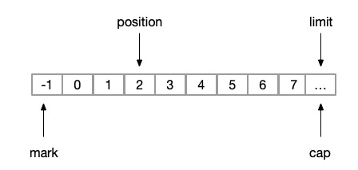

（1）compact
```java

    protected int ix(int i) {
        return i + offset;
    }
    
    public ByteBuffer compact() {
        // 把已经读取的内容使用后面的内容覆盖
        System.arraycopy(hb, ix(position()), hb, ix(0), remaining());
        // 修改状态
        // 将position置为limit - position
        position(remaining());
        // limit为capacity
        limit(capacity());
        // mark置为-1
        discardMark();
        return this;
    }
```
状态转换如下，这里我们可以看到，`position`已经被置为6，但是其实我们是想`position`置为0，这样才符合我们的初衷；所以，从这点分析来看，`compact`方法最好是等缓冲区全部被读完后使用，达到复用ByteBuffer的目的，否则就会造成`空间浪费`
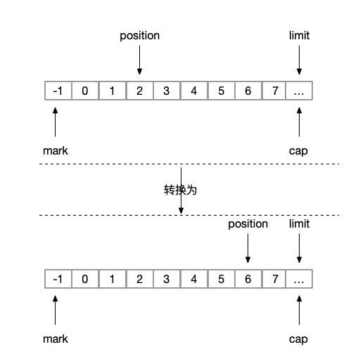

(2) slice
```java
    // 实际是共享当前ByteBuffer数组的空间
    public ByteBuffer slice() {
        return new HeapByteBuffer(hb,-1,0,this.remaining(),this.remaining(),this.position() + offset);
    }
```
最终状态如图，其中带1的部分是为新缓冲区的状态：
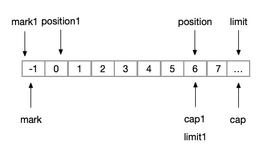

## HeapByteBuffer和MappedByteBuffer
说了这么多Buffer和ByteBuffer的方法，我们再回过头来看看类结构图中ByteBuffer的两个子类，HeapByteBuffer和MappedByteBuffer，通过对比的方式了解下这两者的区别

| | HeapByteBuffer | MappedByteBuffer |
| --- | ----- | ----- |
| 实现 | byte[]数组 | Unsafe实现 |
| 内存分配 | Java堆内存 | 堆外内存 |
| 适用场景 | 复用 | 经常释放和新建 |

这里就不具体介绍这两个类实现的源码了，有兴趣了解Unsafe的同学可以看下我团技术团队推的一篇文章[【基本功】Java魔法类：Unsafe应用解析](https://mp.weixin.qq.com/s/h3MB8p0sEA7VnrMXFq9NBA)

（1）什么是Java堆内存和堆外内存？

- Java堆内存：Java内存结构主要有三大块：堆内存、方法区和栈；堆内存(如下图中的Heap区)是JVM中最大的一块由年轻代和老年代组成，是Java中GC的主要操作空间，是Java进程内的单位

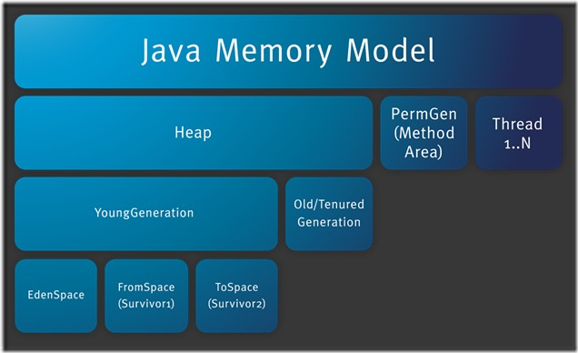

- 堆外内存：不属于Java直接管理的空间，是不能被GC，所以只能手动申请和释放；属于操作系统直接管理的内存空间，是Java进程外的单位

（2）创建和释放的效率对比？

因为JVM堆中分配和释放内存肯定比系统分配和创建内存高效，所以创建和释放MappedByteBuffer的代价比HeapByteBuffer得要高

（3）IO效率对比?
在回答这个问题之前，首先让我们来看一张图

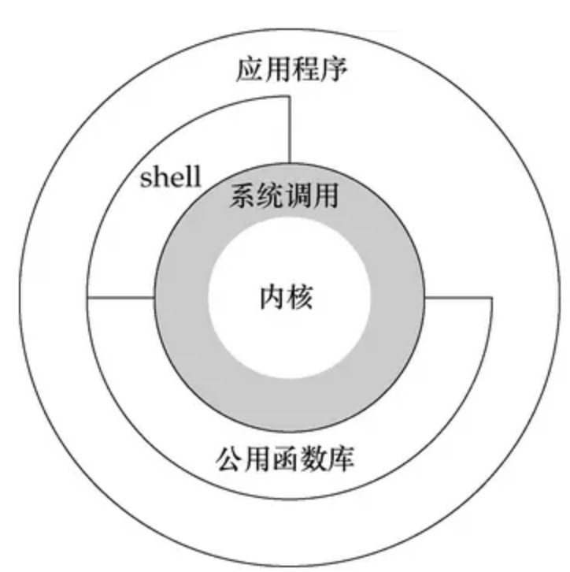

在unix和linux的体系架构中，一般会分为用户态和内核态

- 用户态：上层应用程序的活动空间，应用程序的执行必须依托于内核提供的资源。
- 内核态：用于控制计算机的硬件资源，并提供上层应用程序运行的环境。
- 系统调用：为了使上层应用能够访问到这些资源，内核为上层应用提供访问的接口。

而三者之间的关系为：
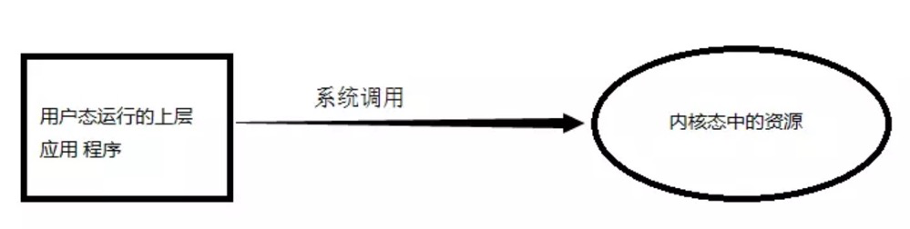

从上述的了解中，我们可以得出内核态的效率会大于用户态的效率

而在平时的read/write操作中，应用程序在与I/O设备进行交互时是需要经历一个“内核缓冲区”的。而MappedByteBuffer就好比是“内核缓冲区”上的缓存，而HeapByteBuffer则是应用程序Java中的内存空间，所以结论显而易见，把一个MappedByteBuffer写入一个Channel的速度要比把一个HeapByteBuffer写入一个Channel的速度要快。 

这里顺便附上一张性能对比图，详见[NIO Buffer performance](https://www.javamex.com/tutorials/io/nio_buffer_performance.shtml)

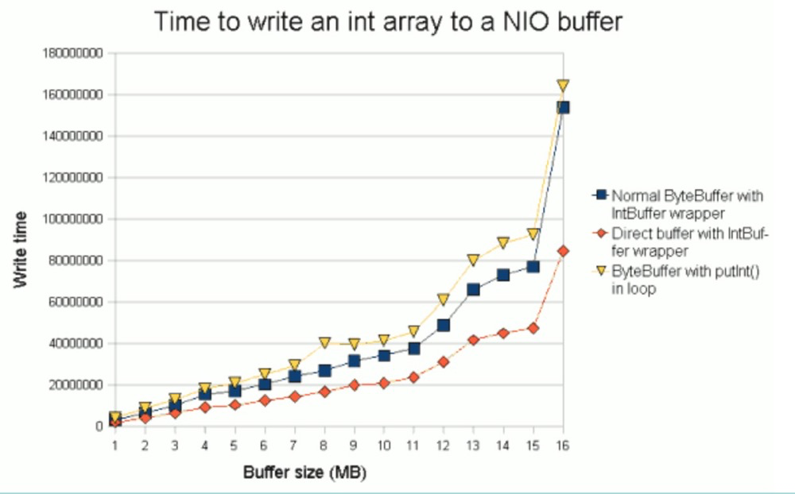


# FYI

- [Java NIO 之 Buffer](http://www.voidcn.com/article/p-tkaqcivn-boa.html)
- [ByteBuffer详解](https://blog.csdn.net/t000818/article/details/79023134)
- [用户态与内核态](https://www.jianshu.com/p/85e931636f27)


