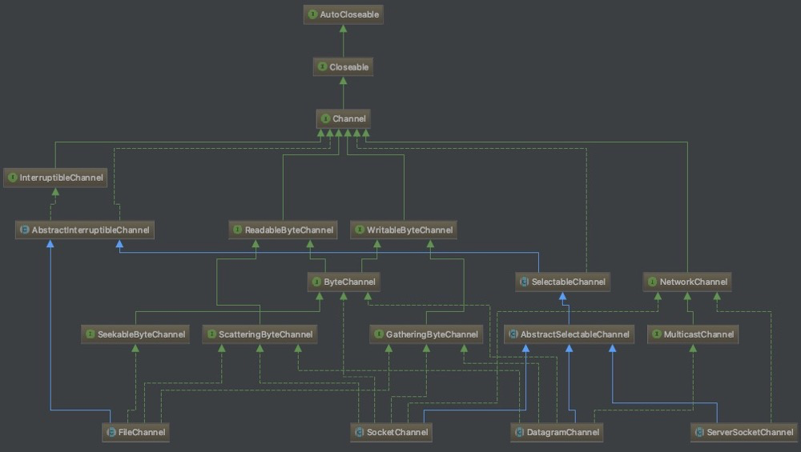

[TOC]

# Channel简介
在Java NIO中，主要有三大基本的组件：Buffer、Channel和Selector，前面两篇文章我们具体介绍了[Selector](https://www.jianshu.com/p/f26f1eaa7c8e)和[Buffer](https://www.jianshu.com/p/60e925972b43),老规矩，就让我们继续慢慢地揭开Channel的神秘面纱吧！

在Java NIO的世界中，Selector是`中央控制器`，Buffer是承载数据的`容器`，而Channel可以说是最基础的`门面`，它是本地I/O设备、网络I/O的`通信桥梁`，只有搭建了这座桥梁，数据才能被写入Buffer，连接才能被Selector控制，

Channel这座桥梁分别为本地I/O设备和网络I/O提供了以下实现，并且和Java IO体系的类是一一对应的：

1. 网络I/O设备：
    - DatagramChannel:读写UDP通信的数据，对应DatagramSocket类
    - SocketChannel:读写TCP通信的数据，对应Socket类
    - ServerSocketChannel:监听新的TCP连接，并且会创建一个可读写的SocketChannel，对应ServerSocket类
2. 本地I/O设备：
    - FileChannel:读写本地文件的数据,不支持Selector控制，对应File类

其类继承结构如下图：



1. 从上图中我们可以看出前面讲述的四个类都是被定义为抽象的，这些类中只是声明了可操作的接口；主要是在不同的操作系统当中，其实际操作本地I/O和网络I/O在实现上会有根本性的差异，就拿Windows和Unix来说，两者的文件系统管理是不一致的（想了解三者I/O架构上的区别可参考[Unix,Linux,Windows的IO架构](https://blog.csdn.net/ora_unix/article/details/8550057)）
2. Channel接口实现了Closeable接口，并且本身还定义`isOpen()`方法，标识所有的Channel都是可以被主动关闭
3. `InterruptibleChannel`接口声明了Channel是可以被中断的
4. `SelectableChannel`接口声明了Channel是可以被选择的(即支持Selector控制)，而FileChannel是没有实现该接口的
5. `WritableByteChannel`和`ReadableByteChannel`接口分别提供了写操作和读操作的API，且是基于Buffer的
6. `ScatteringByteChannel`和`GatheringByteChannel`接口允许您委托操作系统来完成辛苦活：将读取到的数据分开存放到多个存储桶(bucket)或者将不同的数据区块合并成一个整体。这是一个巨大的成就，因为操作系统已经被高度优化来完成此类工作了。它节省了您来回移动数据的工作，也就避免了缓冲区拷贝和减少了您需要编写、调试的代码数量。其分别定义了`write(ByteBuffer[] srcs, int offset, int length)`和`read(ByteBuffer[] dsts, int offset, int length)`
7. `SeekableByteChannel`接口用于控制本地文件的position
8. `NetworkChannel`接口标识了该Channel是属于网络I/O

# ServerSocketChannel
让我们从最简单的`ServerSocketChannel`来开始对socket通道类的讨论。以下是`ServerSocketChannel`的完整 API：
```java
public abstract class ServerSocketChannel extends AbstractSelectableChannel {
    public static ServerSocketChannel open() throws IOException
    public abstract ServerSocket socket();
    public abstract SocketChannel accept() throws IOException;
    //支持的SelectionKey类型，返回OP_ACCEPT
    public final int validOps()
}
```
`ServerSocketChannel`与`ServerSocket`一样是socket监听器，其主要区别前者可以运行在非阻塞模式下运行；

```java
    // 创建一个ServerSocketChannel，将会关联一个未绑定的ServerSocket
    public static ServerSocketChannel open() throws IOException {
        return SelectorProvider.provider().openServerSocketChannel();
    }
```
`ServerSocketChannel`的创建也是依赖底层操作系统实现，其实现类主要是`ServerSocketChannelImpl`，我们来看看其构造方法

```java
class ServerSocketChannelImpl extends ServerSocketChannel implements SelChImpl {

    private final FileDescriptor fd;
    private int fdVal;
    // 这里忽略一些变量
    .....
    private int state = -1;
                                          ServerSocketChannelImpl(SelectorProvider var1) throws IOException {
        super(var1);
        // 创建一个文件操作符
        this.fd = Net.serverSocket(true);
        // 得到文件操作符是索引
        this.fdVal = IOUtil.fdVal(this.fd);
        this.state = 0;
    }
```

新建一个`ServerSocketChannelImpl`其本质是在底层操作系统创建了一个fd(即[文件描述符](https://www.linuxprobe.com/linux-file-descriptor.html))，相当于建立了一个用于网络通信的通道，通过这个通道我们可以和外部网络进行通信；

当然上述操作只是抢占了一个通道，它是无法和外部通信的；我们知道，在实际网络交互中，必须通过端口才能通信，所以呢，下一步我们来看看如何绑定端口

`ServerSocketChannel`貌似没有`bind()`方法来绑定端口，上面我们提到它在创建时会新建一个fd，其本质对应了`ServetSocket`对象，我们看`ServerSocketChannel`的API能看到通过`socket()`对象能获取到`ServetSocket`，此时我们只要调用socket的`bind()`方法绑定即可

```java
ServerSocketChannel#socket#bind(InetSocketAddress)
```

`ServerSocketChannel`最主要的作用就是用于监听TCP连接，其API中也有相应的`accept()`方法来获取TCP连接

```java
public SocketChannel accept() throws IOException {
    // 忽略一些校验及无关代码
    ....
    
    SocketChannelImpl var2 = null;
    // var3的作用主要是说明当前的IO状态，主要有
    /**
    * EOF = -1;
    * UNAVAILABLE = -2;
    * INTERRUPTED = -3;
    * UNSUPPORTED = -4;
    * THROWN = -5;
    * UNSUPPORTED_CASE = -6;
    */
    int var3 = 0;
    // 这里本质也是用fd来获取连接
    FileDescriptor var4 = new FileDescriptor();
    // 用来存储TCP连接的地址信息
    InetSocketAddress[] var5 = new InetSocketAddress[1];
    
    try {
        // 这里设置了一个中断器，中断时会将连接关闭
        this.begin();
        // 这里当IO被中断时，会重新获取连接
        do {
            var3 = this.accept(this.fd, var4, var5);
        } while(var3 == -3 && this.isOpen());
    }finally {
        // 当连接被关闭且accept失败时或抛出AsynchronousCloseException
        this.end(var3 > 0);
        // 验证连接是可用的
        assert IOStatus.check(var3);
    }
    
    if (var3 < 1) {
        return null;
    } {
        // 默认连接是阻塞的
        IOUtil.configureBlocking(var4, true);
        // 创建一个SocketChannel的引用
        var2 = new SocketChannelImpl(this.provider(), var4, var5[0]);
        // 下面是是否连接成功校验，这里忽略...
        
        return var2;
    }
}

// 依赖底层操作系统实现的accept0方法
private int accept(FileDescriptor var1, FileDescriptor var2, InetSocketAddress[] var3) throws IOException {
    return this.accept0(var1, var2, var3);
}
```

# SocketChannel
使用`ServerSocketChannel`可以实时获取到新建的TCP连接，从上面`accpet()`方法得出，其返回的是一个`SocketChannelImpl`对象，其继承的类的是`SocketChannel`，以下是`SocketChannel`的API：

```java
public abstract class SocketChannel extends AbstractSelectableChannel implements ByteChannel, ScatteringByteChannel, GatheringByteChannel {
    // 这里仅列出部分API
    public static SocketChannel open() throws IOException
    public static SocketChannel open(InetSocketAddress remote) throws IOException
    public abstract Socket socket();
    public abstract boolean connect (SocketAddress remote) throws IOException;
    // 当前的连接channel是否有并发连接，非阻塞状态下才有可能返回true
    public abstract boolean isConnectionPending();
    //调用finishConnect()方法来完成连接过程，该方法任何时候都可以安全地进行调用。假如在一个非阻塞模式的SocketChannel对象上调用finishConnect()方法，将可能出现下列情形之一：
    /**
    * 1.connect()方法尚未被调用。那么将产生NoConnectionPendingException异常。
    * 2.连接建立过程正在进行，尚未完成。那么什么都不会发生，finishConnect()方法会立即返回false值。
    * 3.在非阻塞模式下调用connect()方法之后，SocketChannel又被切换回了阻塞模式。那么如果有必要的话，调用线程会阻塞直到连接建立完成，finishConnect()方法接着就会返回true值。
    * 4.在初次调用connect()或最后一次调用finishConnect()之后，连接建立过程已经完成。那么SocketChannel对象的内部状态将被更新到已连接状态，finishConnect()方法会返回true值，然后SocketChannel对象就可以被用来传输数据了。
    * 5.连接已经建立。那么什么都不会发生，finishConnect()方法会返回true值。
    */
    public abstract boolean finishConnect() throws IOException;
    // 是否连接成功
    public abstract boolean isConnected();
    
    // 支持的SelectionKey类型，返回OP_CONNECT,OP_READ,OP_WRITE
    public final int validOps();
    
    public abstract int read(ByteBuffer dst) throws IOException;
    public abstract int write(ByteBuffer src) throws IOException;
}
```
上文我们提到`SocketChannel`是用于读写TCP通信的数据，与`Socket`类一致，其封装的是点对点、有序的网络连接；一个`SocketChannel`的创建必然伴随着会创建一个同等的`Socket`对象(实际是`SocketAdaptor`)，通过`socket`方法能获取；

从API的方法名我们不难看出，其主要作用是

1. 通过`open`方法创建`SocketChannel`，
2. 然后利用`connect`方法来和服务端发起建立连接，还支持了一些判断连接建立情况的方法；
3. `read`和`write`支持最基本的读写操作

下面跟随着上述4点让我们来探究下其底层是怎么工作。

（1）open创建过程
```java
    public static SocketChannel open() throws IOException {
        return SelectorProvider.provider().openSocketChannel();
    }
```

与`ServerSocketChannel`一样，`SocketChannel`的创建也是依赖底层操作系统实现，其实现类主要是`SocketChannelImpl`,创建过程比较简单，实例化了一个fd，并将当前Channel的状态置为了`未连接`

```java
class SocketChannelImpl
    extends SocketChannel
    implements SelChImpl
{
    // Our file descriptor object
    private final FileDescriptor fd;
    
    // fd value needed for dev/poll. This value will remain valid
    // even after the value in the file descriptor object has been set to -1
    private final int fdVal;
    
    // Lock held by current reading or connecting thread
    private final Object readLock = new Object();

    // Lock held by current writing or connecting thread
    private final Object writeLock = new Object();

    // Lock held by any thread that modifies the state fields declared below
    // DO NOT invoke a blocking I/O operation while holding this lock!
    private final Object stateLock = new Object();

    // State, increases monotonically
    private static final int ST_UNINITIALIZED = -1;
    private static final int ST_UNCONNECTED = 0;
    private static final int ST_PENDING = 1;
    private static final int ST_CONNECTED = 2;
    private static final int ST_KILLPENDING = 3;
    private static final int ST_KILLED = 4;
    private int state = ST_UNINITIALIZED;    
    SocketChannelImpl(SelectorProvider sp) throws IOException {
        super(sp);
        // 创建一个scoket通道，即fd(fd的作用可参考上面的描述)
        this.fd = Net.socket(true);
        // 得到该fd的索引
        this.fdVal = IOUtil.fdVal(fd);
        this.state = ST_UNCONNECTED;
    }
}
```

（2）connect建立连接

```java
// Channel的连接过程，这只附了关键部分代码
public boolean connect(SocketAddress sa) throws IOException {
    // 读写都锁住
    lock(readLock&writeLock) {
        /****状态检查，channel和address****/
        // 判断channel是否
        ensureOpenAndUnconnected();
        InetSocketAddress isa = Net.checkAddress(sa);
        /****连接建立****/
        // 阻塞状态变更的锁也锁住
        lock(blockingLock) {
            
            lock(stateLock) {
                // 如果当前socket未绑定本地端口，则尝试着判断和服务端是否能建立连接
                if (localAddress == null) {
                // 和远程建立连接后关闭连接，待会我们详细说一下这个方法
                    NetHooks.beforeTcpConnect(fd,isa.getAddress(),isa.getPort());
                }
            }
            
            for(;;) {
               // 建立连接
               n = Net.connect(fd , ia , isa.getPort());
               // 中断会重新尝试
               if((n == IOStatus.INTERRUPTED) && isOpen()) {
                continue;
               }
               break;
            }
        }
        /****状态变更****/
        lock(stateLock) {
            if(n > 0) {
                state = ST_CONNECTED;
                return;
            }
            
            // 如果连接尚未建立成功，且当前channel是非阻塞的，状态置为pending，此时不允许其他调用，调用时会抛ConnectionPendingException
            if (!isBlocking()) 
                state = ST_PENDING;
        }
    }
    
}

// 这里补充介绍一下NetHooks.beforeTcpConnect方法，这个方法在其他地方也可能遇到

/**********其调用链路如下**********/

// 1. NetHooks#beforeTcpConnect
// 直接被代理跳转到SdpProvider
provider.implBeforeTcpConnect(fdObj, address, port);

// 2. SdpProvider#implBeforeTcpConnect
// 主要是先通过规则校验器判断入参是否符合，一般有PortRangeRule校验器
// 然后再执行将fd转换为socket
for (Rule rule: rules) {
    if (rule.match(action, address, port)) {
        SdpSupport.convertSocket(fdObj);
        matched = true;
        break;
    }
}

// 3. SdpSupport#convertSocket
// 获取fd的索引
int fdVal = fdAccess.get(fd);
// 跳转到native方法
convert0(fdVal);

// 4. SdpSupport.c#convert0
JNIEXPORT void JNICALL
Java_sun_net_sdp_SdpSupport_convert0(JNIEnv *env, jclass cls, int fd)
{
    // create方法实际是通过socket(AF_INET_SDP, SOCK_STREAM, 0);方法得到一个socket
    int s = create(env);
    
    if (s >= 0) {
        socklen_t len;
        int arg, res;
        struct linger linger;

        /* copy socket options that are relevant to SDP */
        len = sizeof(arg);
        // 重用TIME_WAIT的端口
        if (getsockopt(fd, SOL_SOCKET, SO_REUSEADDR, (char*)&arg, &len) == 0)
            setsockopt(s, SOL_SOCKET, SO_REUSEADDR, (char*)&arg, len);
        len = sizeof(arg);
        // 紧急数据放入普通数据流
        if (getsockopt(fd, SOL_SOCKET, SO_OOBINLINE, (char*)&arg, &len) == 0)
            setsockopt(s, SOL_SOCKET, SO_OOBINLINE, (char*)&arg, len);
        len = sizeof(linger);
        // 延迟关闭连接
        if (getsockopt(fd, SOL_SOCKET, SO_LINGER, (void*)&linger, &len) == 0)
            setsockopt(s, SOL_SOCKET, SO_LINGER, (char*)&linger, len);

        // 将fd也引用到s所持有的通道
        RESTARTABLE(dup2(s, fd), res);
        if (res < 0)
            JNU_ThrowIOExceptionWithLastError(env, "dup2");
        // 执行close方法，关闭s这个引用
        RESTARTABLE(close(s), res);
    }
}
```

（3）read
ok，现在Channel已经通过connect方法与服务器连接好了连接，下面我们开始试着读写channel吧

让我们回顾一下，在[Select详解]文章中，我们写了个简单的Selector的例子，其中就包括了读和写操作，我们先看看读操作：

```java
.....

while ((ret = socketChannel.read(buf)) > 0){
   readBytes += ret;
}

.....
```

从具体`socketChannel`中读取内容至buf，返回的是当前IO的状态，让我们来探究下源码

```
1.SocketChannelImpl#read(ByteBuffer buf)
{
    lock(readLock) {
        // 如果buf=null，抛出NullPointerException
        ....
        // 这里有个判断，当channel被关闭时直接返回0
        .....
        // 核心读逻辑
        for (;;) {
            // 通过IOUtil的读取fd的数据至buf
            // 这里的nd是SocketDispatcher，用于调用底层的read和write操作
            n = IOUtil.read(fd, buf, -1, nd);
            if ((n == IOStatus.INTERRUPTED) && isOpen()) {
                continue;
            }
            // 这个方法主要是将UNAVAILABLE(原为-2)这个状态返回0，否则返回n
            return IOStatus.normalize(n);
        }
    }
}

2.IOUtil.read(fd , buf , position , nd)
{
    // 如果buf是只可读，则抛出异常
    throw IllegalArgumentException("Read-only buffer");
    if (dst instanceof DirectBuffer)
        return readIntoNativeBuffer(fd, buf, position, nd);
    
    // 临时缓冲区，大小为buf的remain(limit - position)，堆外内存，使用ByteBuffer.allocateDirect(size)分配
    // Notes：这里分配后后面有个try-finally块会释放该部分内存
    ByteBuffer bb = Util.getTemporaryDirectBuffer(buf.remaining());
    // 将网络中的buf读进direct buffer
    int n = readIntoNativeBuffer(fd, bb, position, nd);
    // 待读取
    bb.flip();
    if (n > 0)
        // 成功时写入
        buf.put(bb);
    return n;
}

3.IOUtil.readIntoNativeBuffer(fd , buf , position , nd)
{
    // ... 忽略一些获取buf变量的代码    
    if (position != -1) {
        // pread方法只有在同步状态下才能使用
        n = nd.pread(fd ,((DirectBuffer)bb).address() + pos,rem, position);
    } else {
        // 其调用SocketDispatcher.read方法 -> FileDispatcherImpl.read0方法
        n = nd.read(fd, ((DirectBuffer)bb).address() + pos, rem);
    }
}
4.FileDispatcherImpl.read0
{
    // 获取fd索引
    jint fd = fdval(env, fdo);
    void *buf = (void *)jlong_to_ptr(address);
    
    // 调用底层read方法
    return convertReturnVal(env, read(fd, buf, len), JNI_TRUE);
}

```

总结一下读取的过程

1. 初始化一个direct buffer，如果本身的buffer就是direct的则不用初始化
2. 调用底层read方法写入至direct buffer
3. 最终将direct buffer写到传入的buffer对象

（4）write
ok，看完了读的过程，我们在看看写的过程；还是之前例子中的写入代码，如下

```java
if (buf.hasRemaining()) {
    socketChannel.write(buf);
}
```

继续探究下源码

```java
1.SocketChannelImpl#write(ByteBuffer buf)
{
    lock(writeLock) {
        //...
        for (;;) {
            // 通过IOUtil的读取fd的数据至buf
            // 这里的nd是SocketDispatcher，用于调用底层的read和write操作
            n = IOUtil.write(fd, buf, -1, nd);
            if ((n == IOStatus.INTERRUPTED) && isOpen()) {
                continue;
            }
            // 这个方法主要是将UNAVAILABLE(原为-2)这个状态返回0，否则返回n
            return IOStatus.normalize(n);
        }
    }
}

2.IOUtil.write(fd, buf, position, nd)
{
    // ....
    if (src instanceof DirectBuffer)
        return writeFromNativeBuffer(fd, buf, position, nd);
        
    ByteBuffer bb = Util.getTemporaryDirectBuffer(rem);
    
    bb.put(buf);
    bb.flip();
    // 这里的pos为buf初始的position，意思是将buf重置为最初的状态;因为目前还没有真实的写入到channel中
    buf.position(pos);
    
    // 调用
    int n = writeFromNativeBuffer(fd, bb, position, nd);
    if (n > 0) {
        buf.position(pos + n);
    }
}


3.IOUtil.writeFromNativeBuffer(fd , buf , position , nd)
{
    // ... 忽略一些获取buf变量的代码    
    int written = 0;
    if (position != -1) {
        // pread方法只有在同步状态下才能使用
        written = nd.pwrite(fd ,((DirectBuffer)bb).address() + pos,rem, position);
    } else {
        // 其调用SocketDispatcher.write方法 -> FileDispatcherImpl.write0方法
        written = nd.write(fd, ((DirectBuffer)bb).address() + pos, rem);
    }
    //....
}

4.FileDispatcherImpl.write0
{
    // 调用底层的write方法写入
    return convertReturnVal(env, write(fd, buf, len), JNI_FALSE);
}

```

总结一下write的过程：

1. 如果buf是direct buffer则直接开始写入，否则需要初始化一个direct buffer，大小是buf的remain
2. 将buf的内容写入到direct buffer中，`并恢复buf的position`
3. 调用底层的write方法写入至channel
4. 更新buf的position，即被direct buffer读取内容后的position

# DatagramChannel
> DatagramChannel是NIO中面向Datagram(数据报)的套接字通道.

一般我们在实际编程中用到这个Channel的情况很少，所以我在这里就不详细说明了，有兴趣的同学可以通过[Java NIO深入理解DatagramChannel](https://blog.csdn.net/yhl_jxy/article/details/79336635)这篇文章了解

# FileChannel
> FileChannel是线程安全的，只能通过FileInputStream,FileOutputStream,RandomAccessFile的getChannel方法获取FileChannel通道，原理是获取到底层操作系统生成的fd(file descriptor)

FileChannel主要是对本地文件操作的NIO中的一套新的机制，后面我们再配合IO部分的内容来仔细研究它

# 总结
这篇文章主要是介绍了Channel通道类在NIO编程中的作用，并主要讲述了`ServerSocketChannel`和`SocketChannel`这两个Channel的底层工作机制，总结一下上面的关键点

1. `ServerSocketChannel`只支持accept事件，`SocketChannel`只支持connect、read、write事件
2. `SocketChannel`的读取和写入都需要依赖direct buffer来做中间转换
3. `SocketChannel`在connect之前会调用`NetHooks#beforeTcpConnect`

# FYI
- [Java NIO Channel详解
](http://blogxin.cn/2017/01/18/Java-NIO-Channel%E8%AF%A6%E8%A7%A3/)
- [Java NIO 的前生今世 之二 NIO Channel 小结](https://segmentfault.com/a/1190000006824107)
- [c语言 - socket编程(三)](https://www.zfl9.com/c-socket-sockopt.html)
- [C++ socket TCP开发基本流程总结](https://zhuanlan.zhihu.com/p/23050384)