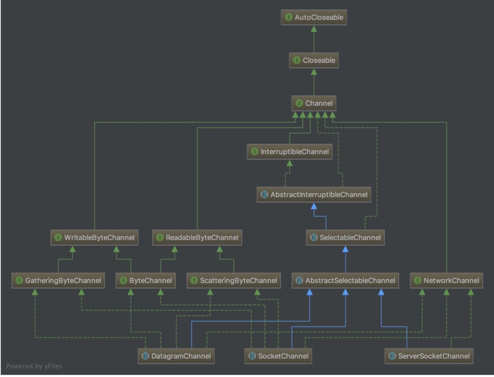

本篇博客的初衷是记录了博主本次阅读系列博客(Java NIO入门教程详解--链接见文末)全文过程中的一些笔记，描述了Java NIO中核心类以及其方法的作用；

# Buffer


1. 属性
    - capacity：容量
    - limit：上界，缓冲区的临界区，即最多可读到哪个位置
    - position：下标，当前读取到的位置(例如当前读出第5个元素，则读完后，position为6)
    - mark：标记，备忘位置
```
大小关系：0 <= mark <= position <= limit <= capacity
```

2. 方法
    - `mark()`：记录当前position的位置，使`mark=position`
    - `reset()`：恢复到上次备忘的位置，即`position=mark`
    - `clear()`：将缓存区置为待填充状态，即`position=0;limit=capacity;mark=-1`
    - `flip()`：将缓冲区的内容切换为待读取状态，即`limit=position;position=0;mark=-1`
    - `rewind()`：恢复缓冲区为待读取状态，即`position=0;mark=-1`
    - `remaining()`：缓冲区剩余元素，即`limit-position`
    - `compact()`：丢弃已经读取的数据，保留未读取的数据，并使缓存中处于待填充状态
    - `isDirect()`：是否是直接操作内存的Buffer；若是，则此Buffer直接操作JVM堆外内存 ，使用Unsafe实现；否则操作JVM堆内存
    - `slice()`：从当前buffer中生成一个该buffer尚未使用部分的新的缓冲区，例如当前buffer的position为3，limit为5，则新的缓冲区limit和capacity都为2，offset的3，数据区域两者共享；

# Channel
>简单的说，Channel即通道，JDK1.4新引入的NIO概念，一种全新的、极好的Java I/O示例，提供与I/O服务的直接连接。Channel用于在字节缓存和位于Channel另一侧的实体(通常是File或Socket)之间有效的传输数据。
>通道(Channel)是一种途径，借助该途径，可以用最小的总开销来访问操作系统本身的I/O服务。缓冲区(Buffer)则是通道内部用来发送和接受消息的端点。





1. 方法
    - `close()`：调用close方法会导致工作在该通道上的线程暂时阻塞；close关闭期间，任何其他调用close方法的线程将会阻塞；如果一个线程工作在该通道上被阻塞并且同时被中断，那么该通道将会关闭
    - `isOpen()`：通道的开关状态

2. Scatter/Gather
[Scatter/Gather](http://www.365mini.com/page/java-nio-course-17.htm)允许您委托操作系统来完成辛苦活：将读取到的数据分开存放到多个存储桶(bucket)或者将不同的数据区块合并成一个整体。这是一个巨大的成就，因为操作系统已经被高度优化来完成此类工作了。它节省了您来回移动数据的工作，也就避免了缓冲区拷贝和减少了您需要编写、调试的代码数量。

## FileChannel
>[FileChannel](http://www.365mini.com/page/java-nio-course-18.htm)是线程安全的，只能通过FileInputStream,FileOutputStream,RandomAccessFile的getChannel方法获取FileChannel通道，原理是获取到底层操作系统生成的fd(file descriptor)

1. 方法
   - FileChannel的position属于共享的，属于底层fd的position，当调用RandomAccessFile的`seek()`方法调整position，则生成的FileChannel对象的position为seek后的值
   - `truncate()`：用于设置文件的长度size，若设置的size<当前size，则多出的部分会被删除
   - `force()`：强制将全部待定的修改都写入磁盘中的文件上(所有的现代文件系统都会缓存数据和延迟磁盘文件更新以提高性能)【**若是force作用于远程文件系统，则不能保证该操作一定能成功，需要验证当前使用的操作系统或文件系统在同步修改方面是否可以依赖**】
    - `transferTo()`和`transferFrom()`：允许将一个通道交叉连接到另一个通道传递数据；

### 文件锁（FileLock）
- 文件锁的对象是文件而不是通道或线程；
- 获得独占锁的前提是对文件有写权限，获得共享锁只要对文件有读权限即可
- 如果一个线程在一个文件上获得了独占锁，若运行在同一JVM上，则另一个线程请求文件的独占锁是允许的；若运行在不同的JVM上，则其线程请求文件的独占锁会被阻塞；因为锁最终是由操作系统或文件系统来判优并且几乎总是在进程级别而不是在线程级别上判优
- 独占锁和共享锁是由底层操作系统或文件系统决定，若底层不支持共享锁，则即使获取锁时的shared参数为true，调用FileLock的`isShared()`方法也将返回false
    - FileLock从获取到之后有效，失效条件：
        1. 调用FileLock中的`release()`方法
        2. 它所关联的通道被关闭
        3. JVM关闭

``` Java
// 这里是FileChannel关于FileLock的API（抛出IOException，这里未列出）

// 获取文件的独占锁（获取操作是阻塞的），等价于调用lock(0,Long.MAX_VALUE , false)
public final FileLock lock()

//指定文件内部锁定区域的开始position以及锁定区域的size，shared标识待获取是共享锁(true)还是独占锁(false)
// 文件锁的范围可以大于文件的大小
public abstract FileLock lock (long position, long size, boolean shared)

// lock方法的非阻塞方式，若是待获取的区域是已经被锁定的，则此时会直接返回null
public final FileLock tryLock()
public abstract FileLock tryLock (long position, long size, boolean shared)
```
### 内存文件映射
>内存文件映射，简单地说就是将文件映射到内存的某个地址上。>1. 普通方式读取文件流程
首先内存空间分为内核空间和用户空间，在应用程序读取文件时，底层会发起系统调用，由系统调用将数据先读入到内核空间，然后再将数据拷贝到应用程序的用户空间供应用程序使用。这个过程多了一个从内核空间到用户空间拷贝的过程。>2. 内存文件映射流程文件会被映射到物理内存的某个地址上（不是数据加载到内存），此时应用程序读取文件的地址就是一个内存地址，而这个内存地址会被映射到了前面说到的物理内存的地址上。应用程序发起读之后，如果数据没有加载，系统调用就会负责把数据从文件加载到这块物理地址。应用程序便可以读取到文件的数据。省去了数据从内核空间到用户空间的拷贝过程。所以速度上也会有所提高。

在Java中，具体内存文件映射的方法是**通过FileChannel的map()方法来创建一个由磁盘文件支持的虚拟文件映射(virtual memory mapping)并在那块虚拟内存空间外部封装一个MappingByteBuffer对象**

- 通过内存映射机制来访问一个文件效率比其他方式高，因为不需要做明确的系统调用；其直接操作的内存使位于JVM堆外的内存，且虚拟内存可以自动缓存内存页(memory page)
- 当为一个文件建立虚拟内   存映射之后，文件数据通常不会因此被从磁盘读取到内存(这取决于操作系统)。该过程类似打开一个文件：文件先被定位，然后一个文件句柄会被创建，当您准备好之后就可以通过这个句柄来访问文件数据

```Java
// 第二、三个参数分别表示映射区域的开始(position)和映射的总大小(size)
// 若map的size>文件的大小，则文件会自动扩容至size

public abstract MappedByteBuffer map(MapMode mode,long position, long size)

MapMode的三种模式，受FileChannel的访问权限控制
1. READ_ONLY：只读权限
2. READ_WRITE：写权限
3. PRIVATE：写时拷贝(copy-on-write)映射；意味着通过`put()`方法所做的任何修改都会导致产生一个对原数据的私有的数据拷贝，之后将修改应用到拷贝后的数据，此份数据只能被当前MappedByteBuffer对象所见;（**Notes：PRIVATE的拷贝是按内存页拷贝的，若一次put操作只修改了前一个内存页的内容，则后一个内存页的被READ_WRITE的修改也会应用到PRIVATE的映射中**）

```

MappedByteBuffer的几个方法如下：

1. `load()`：加载整个文件至内存；该操作将会产生大量的页调入(page-in)，具体数量取决于文件中被映射区域的大小；该方法的主要作用是提前加载文件至内存以方便后续的访问速度尽可能的快
2. `isLoaded()`：判断一个映射文件是否已经完全加载至内存
3. `force()`： 同FileChannel的force方法，强制将缓冲区的修改应用到永久磁盘驱动器

## Socket's Channel
新的Socket通道类可以运行非阻塞模式并且是可选择的。新旧两者对应关系如下：

- [ServerSocketChannel](http://www.365mini.com/page/java-nio-course-25.htm)和ServerSocket
- [SocketChannel](http://www.365mini.com/page/java-nio-course-26.htm)和Socket
- [DatagramChannel](http://www.365mini.com/page/java-nio-course-27.htm)和DatagramSocket

每个Socket's Channel在实例化时都会创建一个对等的Socket对象，调用Channel中的`socket()`方法可获取到；而同时Socket对象也存在`getChannel()`方法，当且仅当通过Channel产生的对等Socket对象，调用`getChannel()`方法才会返回相应的Channel，若是使用传统的方式创建Socket，则调用该方法始终得到的是null

1. 连接实例

```Java
// 连接地址
SocketAddress address = new InetSocketAddress(10011);
/******************** 服务端ServerSocketChannel通道创建 *************************/
// jdk1.7之前的bind方式
ServerSocketChannel serverChannel = ServerSocketChannel.open();
serverChannel.socket().bind(address);
// jdk1.7之后的bind方式
//ServerSocketChannel serverChannel = ServerSocketChannel.bind(address);

/******************** 客户端SocketChannel通道创建 *************************/
SocketChannel clientChannel = SocketChannel.open();
// 通道连接
clientChannel.connect(address);

// Socket对象连接
//clientChannel.socket().connect(address);

// 每个Socket's Channel都继承自AbstractSelectableChannel，可控制通道是否阻塞
channel.configureBlocking(boolean);
// 并且能够获取到修改阻塞方式的锁
channel.blockingLock();
```

### 管道(Pipe)

`java.nio.channels`中含有一个名为[`Pipe`(管道)](http://www.365mini.com/page/java-nio-course-28.htm)的类，作用是使Java进程内部的两个通道(Channel)之间的数据传输;

核心知识：

- 调用`Pipe.open()`方法创建
- `Pipe.SourceChannel`：负责读，调用`Pipe.source()`获取
- `Pipe.SlinkChannel`：负责写，调用`Pipe.slink()`获取

# [Selector(选择器)](http://www.365mini.com/page/java-nio-course-30.htm)
选择器提供选择执行已经就绪任务的能力，其实现依赖底层操作系统的`select()`和`pool()`这两个系统调用，使得Java也能像C或C++提供同时管理多个I/O通道；

[核心功能类](http://www.365mini.com/page/java-nio-course-31.htm)：

- Selector：多个Channel的监听者，通过`select()`方法实时响应就绪好的通道，`keys()`方法其返回的是SelectionKey对象
- SelectorChannel：支持就绪检查的通道类的抽象；其可以被注册到Selector上，一个SelectorChannel可以被注册到多个Selector上，但对每个Selector而言每个SelectorChannel只能注册一次
- SelectionKey：代指了通道与选择器之间的注册关系；

具体细节可参考[NIO教程中的选择器](http://www.365mini.com/page/java-nio-course-32.htm)部分，这里就不做深入描述，之后研究select/pool/epoll的原理时再详细介绍其原理。

#参考资料

- [理解java中的mmap](http://blog.csdn.net/pwlazy/article/details/7370122)
- [Java NIO入门教程详解](http://www.365mini.com/page/java-nio-course-1.htm)