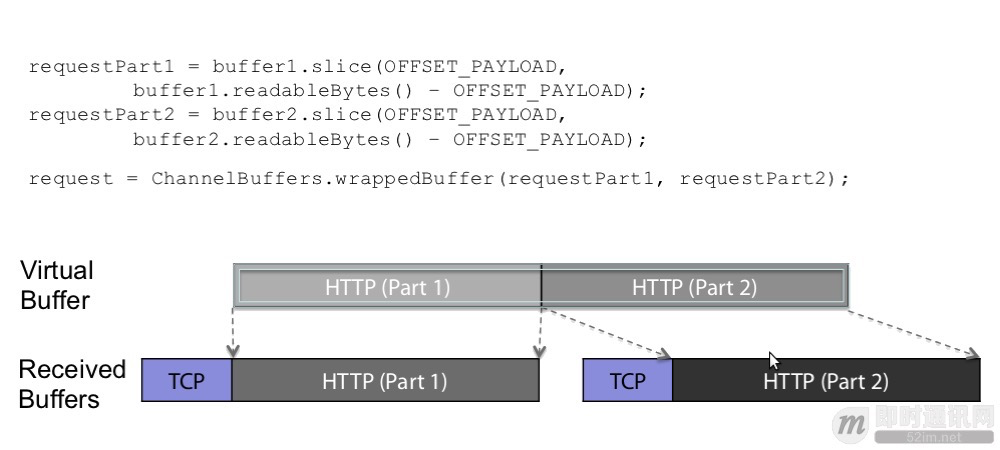
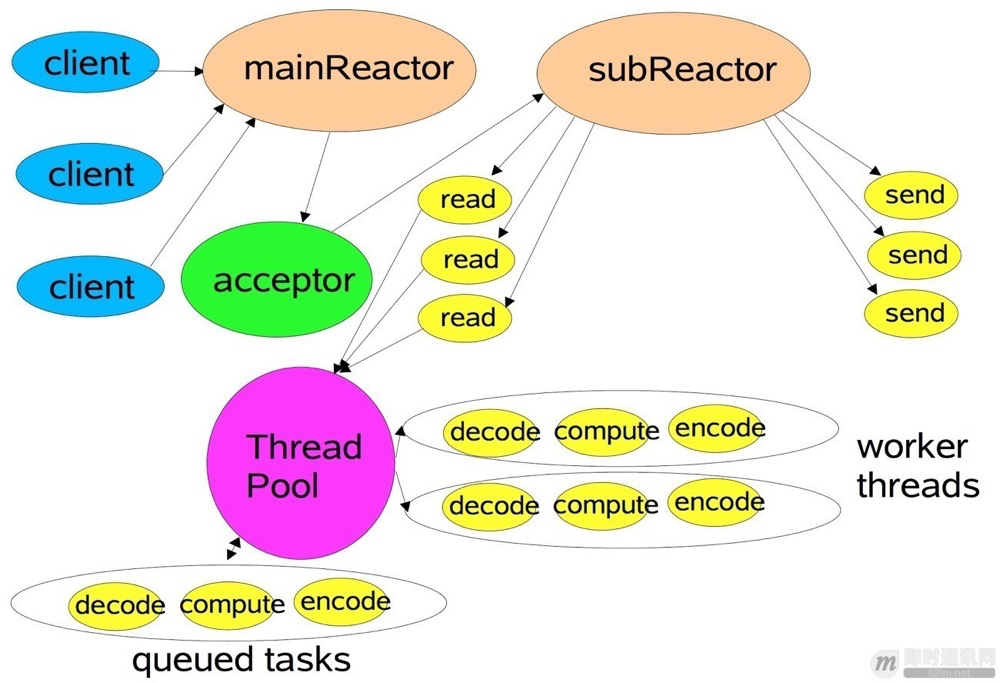
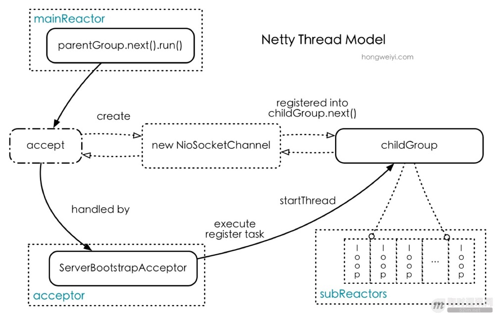
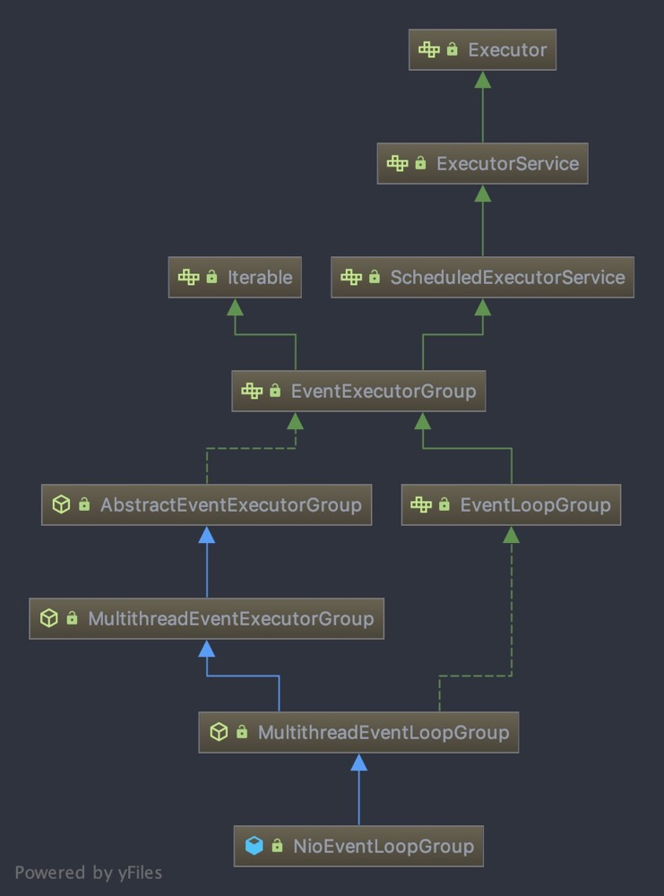
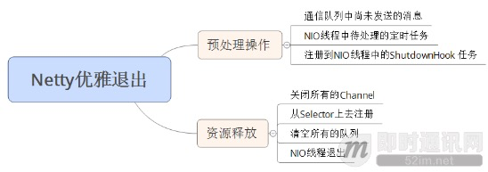
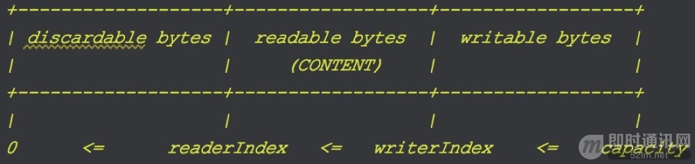

[toc]

- 如何实现零拷贝
- 线程模型
    - EventLoop
    - FastThreadLocalThread

# 零拷贝
传统的zero-copy是IO传输过程中，数据无需中内核态到用户态、用户态到内核态的数据拷贝，减少拷贝次数。
而Netty的zero-copy则是完全在用户态，或者说传输层的zero-copy机制，可以参考下图。由于协议传输过程中，通常会有拆包、合并包的过程，一般的做法就是System.arrayCopy了，但是Netty通过ByteBuf.slice以及Unpooled.wrappedBuffer等方法拆分、合并Buffer无需拷贝数据。

如何实现zero-copy的呢。slice实现就是创建一个SlicedByteBuf对象，将this对象，以及相应的数据指针传入即可，wrappedBuffer实现机制类似。

# 线程模型
Reactor模式有多个变种，Netty基于Multiple Reactors模式（如下图）做了一定的修改，Mutilple Reactors模式有多个reactor：mainReactor和subReactor，其中mainReactor负责客户端的连接请求，并将请求转交给subReactor，后由subReactor负责相应通道的IO请求，非IO请求（具体逻辑处理）的任务则会直接写入队列，等待worker threads进行处理。

Netty的线程模型基于Multiple Reactors模式，借用了mainReactor和subReactor的结构，但是从代码里看来，它并没有Thread Pool这个东东。Netty的subReactor与worker thread是同一个线程，采用IO多路复用机制，可以使一个subReactor监听并处理多个channel的IO请求，我给称之为：「Single Thread with many Channel」。我根据代码整理出下面这种Netty线程模型图：

## EventLoop
有epoll、kqueue等很多种，主要使用的是NioEventLoopGroup

- EventLoopGroup：详见MultithreadEventExecutorGroup的构造方法，默认使用ThreadPerTaskExecutor创建线程；通过newChild来创建EventLoop
- EventLoop：核心是run方法；分发事件和处理任务，继承自EventExecutor
- EventExecutorGroup：维护了EventExecutor组
- EventExecutor：事件分发器及任务处理器；主要维护了taskQueue和线程池对象；

简单来说，EventLoopGroup是管理并且将线程池初始化好交给EventLoop，EventLoop是具体IO事件的分发器、处理者，并负责调度任务

# 优雅退出
[详解Netty的优雅退出机制和原理](http://www.52im.net/thread-348-1-1.html)

Netty的优雅退出总结起来有三大步操作：

1. 把NIO线程的状态位设置成ST_SHUTTING_DOWN状态，不再处理新的消息（不允许再对外发送消息）；
2. **退出前的预处理操作**：把发送队列中尚未发送或者正在发送的消息发送完、把已经到期或者在退出超时之前到期的定时任务执行完成、把用户注册到NIO线程的退出Hook任务执行完成；
3. **资源的释放操作**：所有Channel的释放、多路复用器的去注册和关闭、所有队列和定时任务的清空取消，最后是NIO线程的退出。

# ByteBuf

[Netty 4.x学习（一）：ByteBuf详解](http://www.52im.net/thread-99-1-1.html)

ByteBuf有两个指针，readerIndex和writerIndex，用以控制buffer数组的读写。读逻辑较为简单，不考虑边界的情况下，就是 return array[readerIndex++]; 。

【UnpooledByteBuf】
- 确保可访问，有一个引用计数的机制，引用计数为0，则抛异常(ensureAccessible)
- Reference Count机制：使用完Buf，可通过ReferenceCountUtil.release(msg);释放
- 5.x以前是默认

【Pooled机制】
- 4.x提供，高性能的buffer池；分配策略则是结合了buddy allocation和slab allocation的jemalloc变种
- 优势
    - 频繁分配、释放buffer时减少了GC压力；
    - 在初始化新buffer时减少内存带宽消耗（初始化时不可避免的要给buffer数组赋初始值）；
    - 及时的释放direct buffer。

# 连接管理
> 由于网络不可靠性，实际的长连接中可能出现网络连接中断的情况，所以需要引入一种机制，来检测当前客户端的连接是否是有效的

两种方式：
- TCP协议的keepalive机制：
    - 不是TCP标准协议，默认是关闭的
    - 依赖操作系统实现，默认检测周期是2小时
    - 不适用于UDP
- 自实现心跳机制：客户端与服务端定期交互通信一种特殊的数据包
    1. 客户端：断线重连
    2. 服务端：心跳检测

Netty实现：

- `IdleStateHandler`：当连接注册或建立成功时初始化相应检测任务,如果存在超时，则触发相应IdleState事件
    - `ReaderIdleTimeoutTask`：readerIdleTimeNanos指定读事件空闲时间,对应IdleState.READER_IDLE
    - `WriterIdleTimeoutTask`：writerIdleTimeNanos指定写事件空闲时间，对应IdleState.WRITER_IDLE
    - `AllIdleTimeoutTask`：allIdleTimeout指定读写事件空闲时间，对应IdleState.ALL_IDLE
- `ReadTimeoutHandler`：重写channelIdle方法，抛出异常并关闭连接
- `WriteTimeoutHandler`：write阶段设置超时时间，如果超时则抛出异常并关闭连接

【断线重连】

1. 启动时：connect的future里面加listener，如果失败则再次重新连接
2. 传输过程中：channelInactive中添加重连逻辑