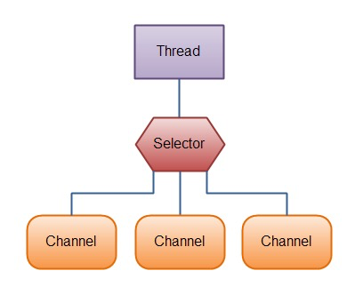

[TOC]

# Selector简述
> A multiplexor of {@link SelectableChannel} objects.

参照Java doc中Selector描述的第一句话，Selector的作用是Java NIO中管理一组多路复用的SelectableChannel对象，并能够识别通道是否为诸如读写事件做好准备的组件



Selector的创建过程如下：

```java
// 1.创建Selector
Selector selector = Selector.open();

// 2.将Channel注册到选择器中
// ....... new channel的过程 ....

//Notes：channel要注册到Selector上就必须是非阻塞的，所以FileChannel是不可以使用Selector的，因为FileChannel是阻塞的
channel.configureBlocking(false);

// 第二个参数指定了我们对 Channel 的什么类型的事件感兴趣
SelectionKey key = channel.register(selector , SelectionKey.OP_READ);

// 也可以使用或运算|来组合多个事件，例如
SelectionKey key = channel.register(selector , SelectionKey.OP_READ | SelectionKey.OP_WRITE);

// 不过值得注意的是，一个 Channel 仅仅可以被注册到一个 Selector 一次, 如果将 Channel 注册到 Selector 多次, 那么其实就是相当于更新 SelectionKey 的 interest set.
```

一个Channel在Selector注册其代表的是一个`SelectionKey`事件，`SelectionKey`的类型包括：

- `OP_READ`：可读事件；值为：`1<<0`
- `OP_WRITE`：可写事件；值为：`1<<2`
- `OP_CONNECT`：客户端连接服务端的事件(tcp连接)，一般为创建`SocketChannel`客户端channel；值为：`1<<3`
- `OP_ACCEPT`：服务端接收客户端连接的事件，一般为创建`ServerSocketChannel`服务端channel；值为：`1<<4`


一个Selector内部维护了三组keys：

1. `key set`:当前channel注册在Selector上所有的key；可调用`keys()`获取
2. `selected-key set`:当前channel就绪的事件；可调用`selectedKeys()`获取
3. `cancelled-key`:主动触发`SelectionKey#cancel()`方法会放在该集合，前提条件是该channel没有被取消注册；不可通过外部方法调用

Selector类中总共包含以下10个方法：

- `open()`:创建一个Selector对象
- `isOpen()`:是否是open状态，如果调用了`close()`方法则会返回`false`
- `provider()`:获取当前Selector的`Provider`
- `keys()`:如上文所述，获取当前channel注册在Selector上所有的key
- `selectedKeys()`:获取当前channel就绪的事件列表
- `selectNow()`:获取当前是否有事件就绪，该方法立即返回结果，不会阻塞；如果返回值>0，则代表存在一个或多个
- `select(long timeout)`:selectNow的阻塞超时方法，超时时间内，有事件就绪时才会返回；否则超过时间也会返回
- `select()`:selectNow的阻塞方法，直到有事件就绪时才会返回
- `wakeup()`:调用该方法会时，阻塞在`select()`处的线程会立马返回；(ps：下面一句划重点)即使当前不存在线程阻塞在`select()`处，那么下一个执行`select()`方法的线程也会立即返回结果，相当于执行了一次`selectNow()`方法
- `close()`: 用完`Selector`后调用其`close()`方法会关闭该Selector，且使注册到该`Selector`上的所有`SelectionKey`实例无效。channel本身并不会关闭。


# 关于SelectionKey

谈到Selector就不得不提SelectionKey，两者是紧密关联，配合使用的；如上文所示，往Channel注册Selector会返回一个SelectionKey对象，
这个对象包含了如下内容：

- interest set,当前Channel感兴趣的事件集，即在调用`register`方法设置的interes set
- ready set
- channel
- selector
- attached object，可选的附加对象

**interest set**
可以通过SelectionKey类中的方法来获取和设置interes set

```java
// 返回当前感兴趣的事件列表
int interestSet = key.interestOps();

// 也可通过interestSet判断其中包含的事件
boolean isInterestedInAccept  = interestSet & SelectionKey.OP_ACCEPT;
boolean isInterestedInConnect = interestSet & SelectionKey.OP_CONNECT;
boolean isInterestedInRead    = interestSet & SelectionKey.OP_READ;
boolean isInterestedInWrite   = interestSet & SelectionKey.OP_WRITE;    

// 可以通过interestOps(int ops)方法修改事件列表
key.interestOps(interestSet | SelectionKey.OP_WRITE);
```

**ready set**
当前Channel就绪的事件列表

```java
int readySet = key.readyOps();

// 也可通过四个方法来分别判断不同事件是否就绪
key.isReadable();    //读事件是否就绪
key.isWritable();    //写事件是否就绪
key.isConnectable(); //客户端连接事件是否就绪
key.isAcceptable();  //服务端连接事件是否就绪

```
**channel和selector**
我们可以通过SelectionKey来获取当前的channel和selector

```java
// 返回当前事件关联的通道，可转换的选项包括:`ServerSocketChannel`和`SocketChannel`
Channel channel = key.channel();

//返回当前事件所关联的Selector对象
Selector selector = key.selector();
```

**attached object**
我们可以在selectionKey中附加一个对象:

```java
key.attach(theObject);
Object attachedObj = key.attachment();
```
或者在注册时直接附加:

```java
SelectionKey key = channel.register(selector, SelectionKey.OP_READ, theObject);
```

# 一个Selector完整的例子
一个Selector的基本使用流程包括（读者不放试着按照这个流程自己实现一波）：

1. 创建一个Selector
2. 将Channel注册到Selector中，并设置监听的interest set
3. loop
   - 执行select()方法
   - 调用selector.selectedKeys()获取当前就绪的key
   - 迭代selectedKeys
       - 从key中获取对应的Channel和附加信息(if exist)
       - 判断是哪些 IO 事件已经就绪了, 然后处理它们. 如果是 OP_ACCEPT 事件, 则调用 "SocketChannel clientChannel = ((ServerSocketChannel) key.channel()).accept()" 获取 SocketChannel, 并将它设置为 非阻塞的, 然后将这个 Channel 注册到 Selector 中.
       - 根据需要更改 selected key 的监听事件.
       - 将已经处理过的 key 从 selected keys 集合中删除.

```java
import java.io.IOException;
import java.io.UnsupportedEncodingException;
import java.net.InetSocketAddress;
import java.nio.ByteBuffer;
import java.nio.channels.SelectionKey;
import java.nio.channels.Selector;
import java.nio.channels.ServerSocketChannel;
import java.nio.channels.SocketChannel;
import java.nio.charset.Charset;
import java.util.Iterator;
import java.util.Set;

/**
 * Created by locoder on 2019/2/28.
 */
public class SelectorDemo {

    public static void main(String[] args) throws IOException {
        // create a Selector
        Selector selector = Selector.open();

        // new Server Channel
        ServerSocketChannel ssc = ServerSocketChannel.open();
        // config async
        ssc.configureBlocking(false);

        ssc.socket().bind(new InetSocketAddress(8080));

        // register to selector
        // Notes：这里只能注册OP_ACCEPT事件，否则将会抛出IllegalArgumentException,详见AbstractSelectableChannel#register方法
        ssc.register(selector, SelectionKey.OP_ACCEPT);

        // loop
        for (; ; ) {
            int nKeys = selector.select();

            if (nKeys > 0) {
                Set<SelectionKey> keys = selector.selectedKeys();

                for (Iterator<SelectionKey> it = keys.iterator(); it.hasNext(); ) {
                    SelectionKey key = it.next();

                    // 处理客户端连接事件
                    if (key.isAcceptable()) {
                        ServerSocketChannel serverSocketChannel = (ServerSocketChannel) key.channel();

                        SocketChannel clientChannel = serverSocketChannel.accept();

                        clientChannel.configureBlocking(false);

                        clientChannel.register(selector, SelectionKey.OP_READ, ByteBuffer.allocate(1024 * 1024));

                    } else if (key.isReadable()) {
                        SocketChannel socketChannel = (SocketChannel) key.channel();

                        ByteBuffer buf = (ByteBuffer) key.attachment();

                        int readBytes = 0;
                        int ret = 0;

                        try {
                            while ((ret = socketChannel.read(buf)) > 0) {
                                readBytes += ret;
                            }

                            if (readBytes > 0) {
                                String message = decode(buf);
                                System.out.println(message);

                                // 这里注册写事件，因为写事件基本都处于就绪状态；
                                // 从处理逻辑来看，一般接收到客户端读事件时也会伴随着写，类似HttpServletRequest和HttpServletResponse
                                key.interestOps(key.interestOps() | SelectionKey.OP_WRITE);

                            }
                        } finally {
                            // 将缓冲区切换为待读取状态
                            buf.flip();
                        }

                    } else if (key.isValid() && key.isWritable()) {
                        SocketChannel socketChannel = (SocketChannel) key.channel();

                        ByteBuffer buf = (ByteBuffer) key.attachment();

                        if (buf.hasRemaining()) {
                            socketChannel.write(buf);
                        } else {
                            // 取消写事件，否则写事件内的代码会不断执行
                            // 因为写事件就绪的条件是判断缓冲区是否有空闲空间，绝大多时候缓存区都是有空闲空间的
                            key.interestOps(key.interestOps() & (~SelectionKey.OP_WRITE));
                        }

                        // 丢弃本次内容
                        buf.compact();
                    }
                    // 注意, 在每次迭代时, 我们都调用 "it.remove()" 将这个 key 从迭代器中删除,
                    // 因为 select() 方法仅仅是简单地将就绪的 IO 操作放到 selectedKeys 集合中,
                    // 因此如果我们从 selectedKeys 获取到一个 key, 但是没有将它删除, 那么下一次 select 时, 这个 key 所对应的 IO 事件还在 selectedKeys 中.
                    it.remove();
                }
            }

        }
    }

    /**
     * 将ByteBuffer转换为String
     *
     * @param in
     * @return
     * @throws UnsupportedEncodingException
     */
    private static String decode(ByteBuffer in) throws UnsupportedEncodingException {
        String receiveText = new String(in.array(), 0, in.capacity(), Charset.defaultCharset());
        int index = -1;
        if ((index = receiveText.lastIndexOf("\r\n")) != -1) {
            receiveText = receiveText.substring(0, index);
        }
        return receiveText;
    }

}

```

# 深入Selector源码
下面我们继续按照Selector的编码过程来学习Selector源码

（1）创建过程


>从上图上可以比较清晰得看到，openjdk中Selector的实现是SelectorImpl,
然后SelectorImpl又将职责委托给了具体的平台，比如图中框出的linux2.6以后才有的EpollSelectorImpl, Windows平台则是WindowsSelectorImpl, MacOSX平台是KQueueSelectorImpl.

```java
public static Selector open() throws IOException {
    return SelectorProvider.provider().openSelector();
}
// 创建是依赖SelectorProvider.provider()系统级提供
// 我们来看SelectorProvider.provider()方法
// 从系统配置java.nio.channels.spi.SelectorProvider获取
if (loadProviderFromProperty()) return provider;
// 从ServiceLoader#load
if (loadProviderAsService()) return provider;
// 如果还不存在则使用默认provider，即KQueueSelectorProvider
provider = sun.nio.ch.DefaultSelectorProvider.create();

```
（2）注册过程
```java
// AbstractSelectableChannel#register方法
SelectionKey register(Selector sel, int ops,Object att){
        synchronized (regLock) {
            // 判断当前Channel是否关闭
            if (!isOpen())
                throw new ClosedChannelException();
            // 判断参数ops是否只包含OP_ACCEPT
            if ((ops & ~validOps()) != 0)
                throw new IllegalArgumentException();
            // 使用Selector则Channel必须是非阻塞的
            if (blocking)
                throw new IllegalBlockingModeException();
            // 根据Selector找到SelectionKey，它是可复用的，一个Selector只能有一个SelectionKey，如果存在则直接覆盖ops和attachedObject
            SelectionKey k = findKey(sel);
            if(key != null) {
                ....
            }
            // 如果不存在则直接实例化一个SelectionKeyImpl对象，并为ops和attachedObject赋值；实际调用AbstractSelector的register方法
            // 将Selector和SelectionKey绑定
            if (k == null) {
                // New registration
                synchronized (keyLock) {
                    if (!isOpen())
                        throw new ClosedChannelException();
                    k = ((AbstractSelector)sel).register(this, ops, att);
                    addKey(k);
                }
            }
            return k;
        }
    }
```
（3）select过程
select是Selector模型中最关键的一步，下面让我们来研究一下其过程

```java
// 首先来看select的调用链
// SelectorImpl#select -> SelectorImpl#lockAndDoSelect -> 具体provider提供的Selector中的doSelect方法
// 值得注意的是：在lockAndDoSelect方法中执行了`synchronized(this)`操作，故select操作是阻塞的

// open过程中我们知道，Selector有好几种实现，但基本都包含以下操作;感兴趣的同学可以具体看看这位大神写的博客：https://juejin.im/entry/5b51546df265da0f70070b93；这里就不深入写这部分了，篇幅有点长

int doSelect(long timeout) {
    // close判断，如果closed，则抛出ClosedSelectorException
    
    // 处理掉被cancel掉的SelectionKey，即`cancelled-key`
    this.processDeregisterQueue();
    
    try {
        // 设置中断器，实际调用的是AbstractSelector.this.wakeup();方法
    // 调用的是方法AbstractInterruptibleChannel.blockedOn(Interruptible);
        this.begin();
        // 从具体的模型中(kqueue、poll、epoll)选择
        this.pollWrapper.poll(...);
    }finally {
        // 关闭中断器
        this.end();
    }
    
    // 重新处理被cancel的key
    this.processDeregisterQueue();
    // 更新各个事件的状态
    int selectedKeys = this.updateSelectedKeys();
    
    // 可能还有一些操作
    .....
    
    return selectedKeys;
    
    
    
    
}

```

# 疑惑点
Q：各事件分别在什么条件下就绪？

- OP_ACCEPT:客户端向服务端发起TCP连接建立【服务端的代码监听】
- OP_CONNECT:客户端与服务端的连接建立成功或失败【客户端代码监听】
- OP_READ:客户端向服务端发请求或服务端向客户端写入数据时
- OP_WRITE:判断缓冲区是否有空闲空间


# FYI
- [java NIO selector全面深入理解](https://blog.csdn.net/lw305080/article/details/51205545)
- [Java NIO中Write事件和Connect事件](https://segmentfault.com/a/1190000017777939)
- [Java NIO 的前生今世 之四 NIO Selector 详解](https://segmentfault.com/a/1190000006824196)
- [Java NIO分析(8): 高并发核心Selector详解](https://juejin.im/entry/5b51546df265da0f70070b93)