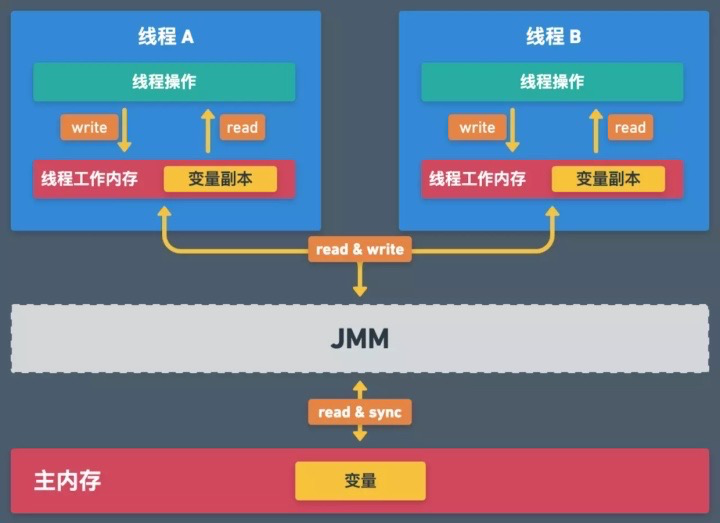
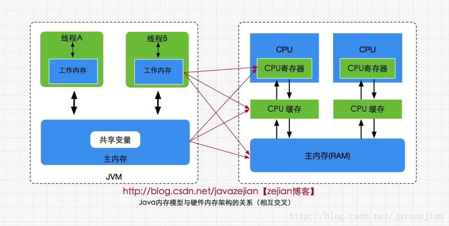

[TOC]

# 概述
【使用锁的思路】
1. 尽量不用锁：cas+自旋、内存屏障等
2. 需要用锁：分段锁、最小代码粒度锁
3. 必须用锁：synchronized、lock

# 1、JMM
JMM定义了线程及内存的交互方式，内存区域主要分为两部分：

1. `主内存`：所有线程**共享的**，线程间的变量传递都依赖主内存
2. `工作内存`：每个线程**独有的**，变量的读取及修改等操作必须在工作内存中发生，后同步到主内存

JMM与硬件内存架构的关系：

通过以下八个原子操作来保证：

## FYI

- [全面理解Java内存模型(JMM)及volatile关键字](https://blog.csdn.net/javazejian/article/details/72772461)

# 2、线程安全
> 多个线程共同执行的情况下，每个线程都能被正确的执行

在JMM中，变量存储在主内存中，但每个线程都会有一份自己的线程副本，其围绕着程序执行的以下几个性质：

1. `原子性`：对主内存的操作要么全部成功，要么全部失败
2. `可见性`：不同线程间对变量的修改是可见的
3. `有序性`：程序的执行严格按照代码顺序执行；但JVM的编译器和处理器有可能会对指令重排，可能会无序

JMM本身定义了一套happens-before原则来保证多线程环境下两个操作的上述三个性质；当然也提供了一些关键字或类。

- `锁机制`：synchronized、Lock等可以保证原子性、可见性、有序性
- `volatile`：保证可见性

# 3、锁

## 3.1、什么是锁？

与现实生活中的锁一样，锁了为了保护私人的物品(代码)，多个线程只有能获取到锁的线程才能工作，后续的线程只有等持续锁的线程释放后来执行

## 3.2、锁相关知识

【锁类型】

- 独占锁(X)：只有一个线程可以获取锁
- 共享锁(S)：允许有多个线程可以获取锁
- 可重入锁：如果当前线程已经持有锁，则可以继续获取该锁
- 读写锁：读锁(S锁)和写锁(X锁)
    - 写时不可读，读时不可写
    - 即可以存在多个线程在读；有线程持有读锁不能写锁无法获取(为了保证写对读是可见的)

【获取锁的方式】

- 乐观锁：不加锁，版本号机制，对数据添加版本号，每次修改判断版本号与持有的版本号是否一致，如果一致可以修改，否则自旋式的获取
- 悲观锁：加锁方式，每次都数据的读取和修改都会加锁

## 3.3、Java的锁

### 3.3.1、synchronized
> Java提供的关键字，其本质是属于可重入的独占锁

#### 3.3.1.1 使用方式
1. 方法上
    - 非静态方法：锁住的是对象本身
    - 静态方法：锁住的类对应的字节码，即类.class
2. 代码块

#### 3.3.1.2 原理

- 方法：依赖ACC_SYNCHRONIZED修饰符实现；其实际是在Class文件的方法表中将access_flag字段中的synchronized标志置为1，即调用该方法是需要获取的对象或所属的Class的锁
- 代码块：使用`monitorenter`和`monitorexit`指令实现
    - `monitorenter`：获取锁
    - `monitorexit`：释放锁

#### 3.3.1.3 Java对象头
在Hotspot虚拟机中，Java对象头主要包含两部分内容：

1. `Mark Word`：存储对象自身的运行时数据，一般占两个机器码(32位系统中，1个机器码等于4字节)，如果对象是数组，则占三个机器码(数组元数据无法确定数组大小，所以需要用一块来记录数组长度)
    - 对象的hashcode
    - GC分代年龄
    - 锁状态标记
    - 线程持有的锁
    - 偏向线程ID
    - 偏向时间戳
2. `Klass Pointer`：指向类元数据的指针

`Mark Word`的存储结构：

`Mark Word`是非固定的数据结构，在程序不同阶段是不同的状态，变化如下：

#### 3.3.1.4 Monitor
> Java内部的同步机制，所有Java对象是天生的Monitor

- 线程私有的数据结构
- 每个线程都有一个可用的`monitor record`列表，还有一个全局的可用列表
- 每一个锁住的对象都会和一个monitor关联（对象头的`Mark Word`的LockWord指向monitor的起始地址）

【数据结构】
- `Owner`：当线程获取锁成功设置为线程唯一标识，否则为NULL
- `EntryQ`：关联一个系统互斥锁（semaphore），阻塞所有试图锁住`monitor record`的线程
- `RcThis`：blocking或waiting的线程个数
- `Nest`：可重入的计数
- `HashCode`：保存从对象头拷贝过来的HashCode(可能还包含GC age)
- `Candidate`：标识是否存在后续线程需要被唤醒，避免唤醒所有线程引起不必要的上下文切换
    - 0：没有需要唤醒的线程
    - 1：表示要唤醒一个继任线程来竞争锁

#### 3.3.1.5 锁优化

- 1.4.2以前：悲观锁机制
- 1.4.2以后：引入自旋锁
- 1.6以后：引入锁粗化、锁消除、偏向锁、轻量级锁、重量级锁等
    - 锁粗化：多个锁合并成一个锁（依赖逃逸分析技术）
    - 锁消除：编译器阶段，去除一些不需要的锁操作，如局部变量Vector的锁等（依赖逃逸分析技术）

1. 偏向锁：默认认为是偏向锁，即认为只有一个线程去获取锁，CAS将对象头的`Mark Word`记录当前线程为owner（独占此记录），记录成功则获取到锁，反之等待全局安全点后(没有字节码在执行)暂停持有锁的线程
    - 持有锁的线程已经终止：重新获取偏向锁，更改当前线程为owner
    - 持有锁的线程还在运行：修改对象头的标识为轻量级锁00(进化)，并唤醒暂停的线程，随后自旋获取轻量级锁
2. 轻量级锁：CAS将对象头的`Mark Word`指向线程栈中的Lock Record，更新成功则获取成功，否则说明已经有线程获取到锁，进入自旋(默认10次)获取锁的状态，有两种情况
    - 自旋可以获取到锁：继续保持轻量级锁
    - 自旋获取不到锁：进化为重量级锁10；后续所有的线程来竞争都是重量级锁；【锁只能升级不能退化】
3. 重量级锁：

### 3.3.2、AQS和ReentrantLock
> Java提供的一种构建锁和同步器的框架

基本属性：
1. CLH队列：同步队列，双端双向链表。AQS维护了head和tail指针，使用CAS来操作内存指向
2. state：同步状态

关键操作：

1. `acquire`：获取锁操作。如果无法获取锁则加入到CLH队列的队尾
2. `release`：释放锁操作。唤醒head的后继节点去获取锁

锁类型：

1. 公平锁：获取锁的条件是当前线程是head，且当前state=0
2. 非公平锁：获取锁的条件是当前state=0

【为什么是双向队列】

1. 插入效率
2. 唤醒后继者时需要判断当前节点的前置节点是否是头结点
3. 前驱节点遍历是线程安全的

### 3.3.3、ReentrantReadWriteLock

读写锁：写锁-排它锁，读锁-共享锁

资源：高16位--读状态，低16位--写状态

- 重入性：同一个线程在写或读时可重入
- 共享：多个线程可共享读锁
- 锁降级：已获取写锁，获取读锁再释放写锁次序；写锁能降级为读锁
- 读时不可写：当存在读锁时，无法获取写锁。【为了保障写锁能让读锁可见。这一步也导致了当存在大量读时，会导致写饥饿，即获取不到写锁】

### 3.3.4、StampedLock

增强读写锁：ReentrantReadWriteLock的升级版，为了解决读时不可写的问题。

- 非AQS实现，使用64位state来控制
- 基于版本号来进行乐观读

#### 3.3.4.1、state状态实现

- 0-6位：读锁计数，当超出RFULL（126）时，用readerOverflow作为读锁计数。当获取到读锁时，state加RUINT(值为1)；当释放读锁时，state减去RUINT。
- 第7位：写锁标识，1=写锁，0=读锁。当线程获取写锁或释放写锁时，都会将state加WBIT
- 8-64位：初始第8位=1，写锁变更时会+1