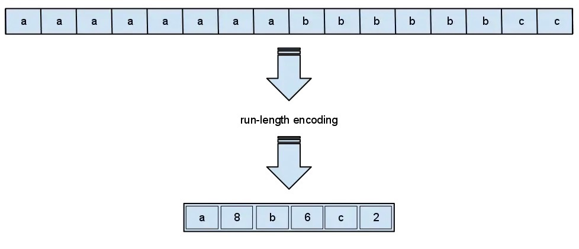
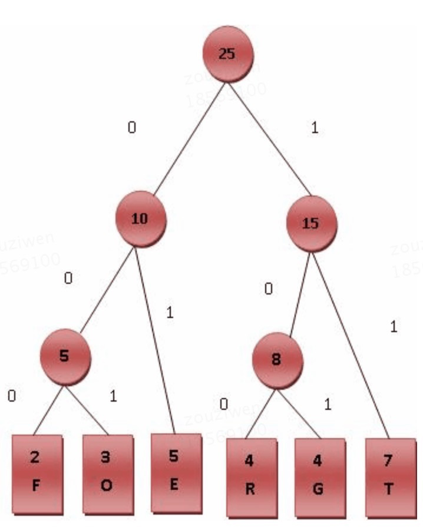
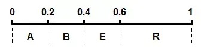
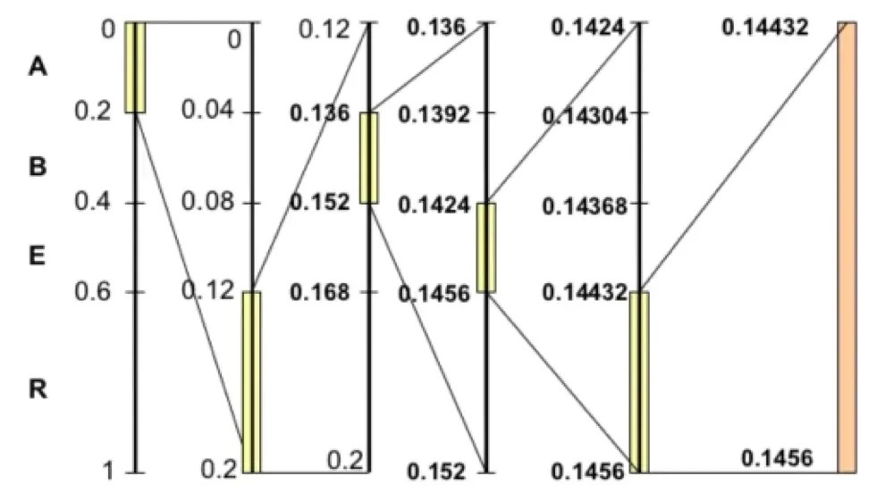
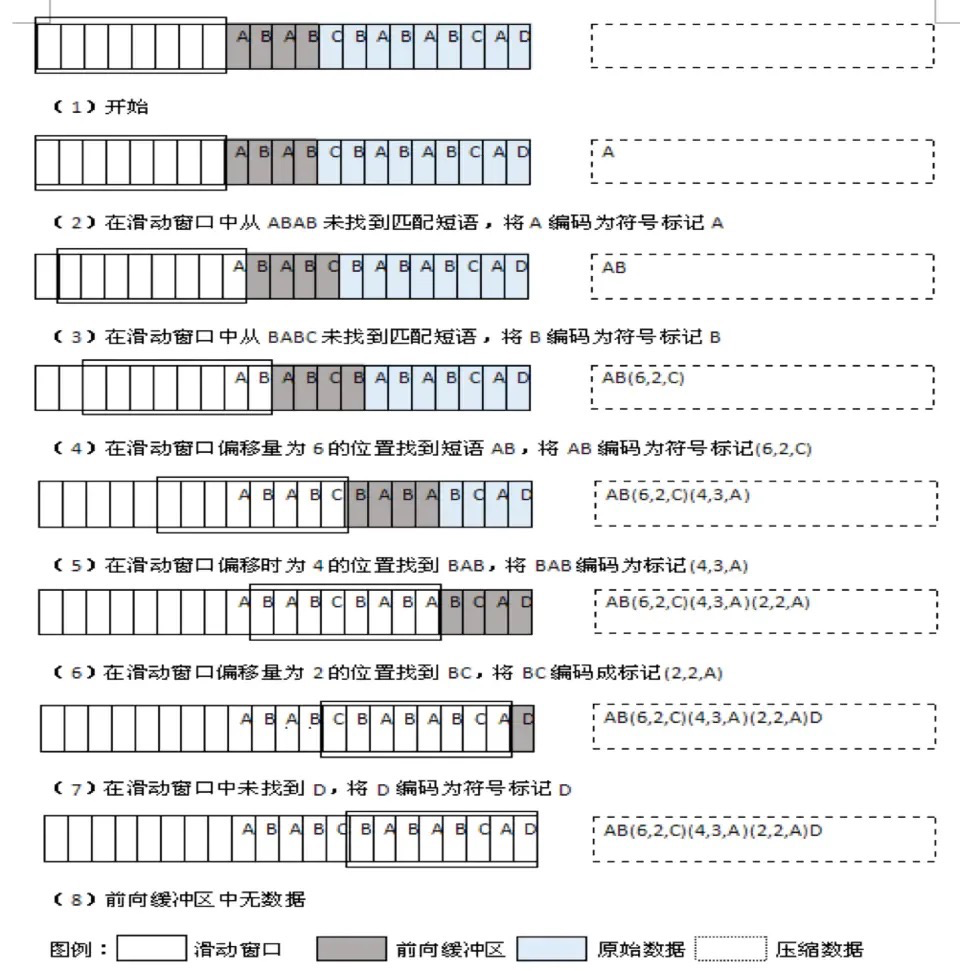

> 不同的压缩算法之间区别最大的即在于编码方式。所谓编码其本质即把信息进行某种方式的转换，以便让信息能够装载进目标载体。从信息论的角度来说，编码的本意并非改变信息的熵密度，而只是改变信息的表现形式。

[toc]

# 游程编码

该算法的实现是用当前数据元素以及该元素连续出现的次数来取代字符串中连续出现的数据部分。

1. 如果元素出现多次，则记录为 元素名 + 次数
2. 如果元素仅出现1次，则记录为 元素名

# 熵编码

熵编码被人所熟知的一种即是Huffman编码，它的原理是根据字符在原始串中出现的**概率**。通过构造一颗**二叉树**来为每个字符产生对应的码字，又称最佳编码。

【什么是huffman编码？】

1. 构建huffman树
   1. 统计字符串(大小为N)中每个字符出现的频率，并从小到大排序
   2. 将频率最小的两个字符填入树的底层，并将两个频率相加得到新频率S，新频率S的左子树和右子树分别为最小字符和第二小字符
   3. 在新频率S与剩下N-2个字符的频率中重复b
   4. 直到所有字符都在填充到huffman树
2. 进行编码
   1. 给huffman树的左链接记为0，右链接记为1
   2. 自顶向下给每个字符进行编码

如下haffman树，F的编码为000

# 算数编码

算数编码是基于字符在原始串中出现的概率。其原始编码是一个介于0-1之间的小数。

例子：原始串ARBER，能得出每个字符出现的概率：

| Symbol | Times | P    | Interval |
| ------ | ----- | ---- | -------- |
| A      | 1     | 0.2  | 0-0.2    |
| B      | 1     | 0.2  | 0.2-0.4  |
| E      | 1     | 0.2  | 0.4-0.6  |
| R      | 2     | 0.4  | 0.6-1.0  |

通过这张概率表，我们可以将0~1这个区间按照概率划分给不同的字符。

编码器将当前的区间分成若干子区间，每个子区间的长度与当前上下文下可能出现的对应符号的概率成正比。当前要编码的符号对应的子区间成为在下一步编码中的初始区间。

以ARBER为例，由上图可以得到以下类推流：

A的区间是(0,0.2),这个区间成为下一步编码的初始区间。R的区间是(0.6,1.0),那么在初始区间(0,0.2)中取**相对**的(0,6,1.0)区间即(0,12,0.2)做这一步编码结果，也即是下一步编码的子区间。以此类推，最终得到了(0.14432,0.14456)作为结果区间。

# 字典编码

字典编码是用符号代替一串字符，例如1=abcd，2=abc等，其实就是对字符建索引

# LZ77编码

> LZ77是Abraham Lempel与Jacob Ziv在1977年以及1978年发表的论文中的一种无损压缩编码。
>
> 它通过使用编码器或者解码器中已经出现过的相应匹配数据信息替换当前数据从而实现压缩功能。这个匹配信息使用称为*长度-距离对*的一对数据进行编码。
>
> 编码器和解码器都必须保存一定数量的最近的数据，如最近2 KB、4 KB或者32 KB的数据。保存这些数据的结构叫作滑动窗口，因为这样所以LZ77有时也称作滑动窗口压缩。

关于LZ77编码，还有一点需要了解的是它如何表示被压缩数据。它并非是对单个字符进行编码，而是对匹配的字符串进行编码。形式为(p,l,c).p表示匹配在滑动窗口的相对起始下标，l表示匹配到滑动窗口的字符串的长度，c表示第一个未匹配的字符。

拿ABABCBABABCAC举例，使用长度为8byte的滑动窗口，长度为4byte的前向缓冲区。

# ANS编码

2014年被提出。本质上属于算数编码，并使用一个近似概率表示的表格，将原来的概率计算转换为查表。FSE(Finite State Entropy)是ANS最为著名的实现。

# FYI

- [编码压缩探索与实践](https://juejin.im/post/6844903889368514567)