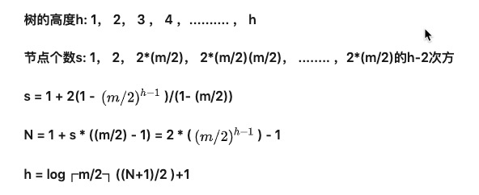
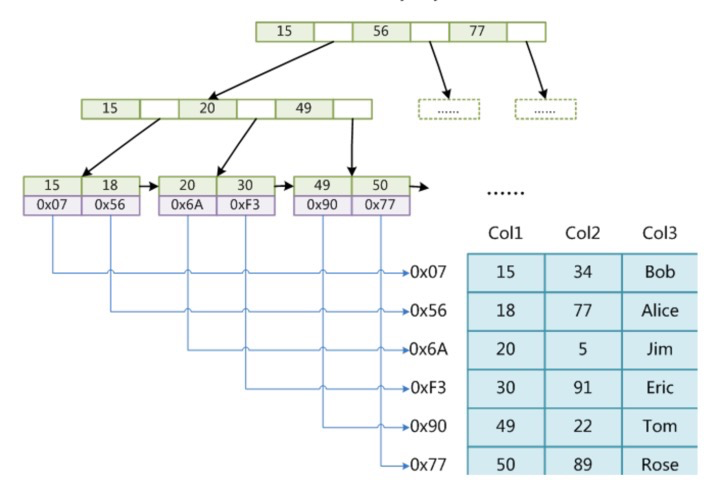

# B-Tree

## 概念及特性

m 阶B-Tree：一个节点能拥有的最大子节点数来表示这颗树的阶数。举个例子，如果一个节点最多有 n 个key，那么这个节点最多就会有 n+1 个子节点，这棵树就叫做 n+1（m=n+1）阶树

1. 每个节点最多有 m 个子节点
2. 除根节点和叶子节点，其它每个节点至少有 [m/2] （向上取整的意思）个子节点
3. 若根节点不是叶子节点，则其至少有2个子节点
4. 所有NULL节点到根节点的高度都一样
5. 除根节点外，其它节点都包含 n 个key，其中 [m/2] -1 <= n <= m-1

## 分裂规则

m阶B-Tree自下而上分裂规则：

1. 当key的个数等于m时，由下标`(m-1)/2`的节点升为父节点，小于`(m-1)/2`的为左孩子，大于`(m-1)/2`的为右孩子
2. 当某个key被升为父节点时，
   - 若父节点key小于`m-1`：会优先连接在该key的父节点的后面()
   - 若父节点key等于`m`时：重复1步骤

## 高度公式

$$
s = 1 + 2 \frac{(1 - (\frac{m}{2})^{h-1})}{1 - \frac{m}{2}}
$$

若B树某一非叶子节点包含N个关键字，则此非叶子节点含有N+1个孩子结点，而所有的叶子结点都在第I层，我们可以得出：

1. 因为根至少有两个孩子，因此第2层至少有两个结点。
2. 除根和叶子外，其它结点至少有┌m/2┐个孩子，
3. 因此在第3层至少有2*┌m/2┐个结点，
4. 在第4层至少有2*(┌m/2┐^2)个结点，
5. 在第 I 层至少有2*(┌m/2┐^(l-2) )个结点，于是有： N+1 ≥ 2*┌m/2┐I-2；
6. 考虑第L层的结点个数为N+1，那么2*(┌m/2┐^(l-2)）≤N+1，也就是L层的最少结点数刚好达到N+1个，即： I≤ log┌m/2┐((N+1)/2 )+2；
   　
   所以

- 当B树包含N个关键字时，B树的最大高度为l-1（因为计算B树高度时，叶结点所在层不计算在内），即：l - 1 = log┌m/2┐((N+1)/2 )+1。

## 删除

**宝典：在满足5条特性的基础上删除，重点是2，5**

删除规则：寻找待删除key的后继key进行替换

定义几个名词：

- key充足：节点的key个数大于[m/2]
- key不充足：节点的key个数等于[m/2] -1

1. 如果删除节点key充足，直接删除
2. 如果删除节点的key不充足时，
   1. 若后继节点满足key充足，将后继节点的第一个key替换待删除key
   2. 若无后继节点，从父节点取一个key，并递归父节点使其满足特性【问题：取父节点的哪个key？优先找next的key，如果没有则找pre的key】

# B+Tree

第一：在 B-Tree中一个含有n个子树的节点有n-1个关键字(key)。而在 B+Tree中一个含有n个子树的节点有n个关键字(key)。为什么在拥有同样子树的情况下B+Tree的节点多需要一个key呢？那是因为 B+Tree的节点会存储该节点的子树中最小的key。

第二：B-Tree的每个节点都包含了关键字(key)以及指向包含这些关键字记录的指针。而 B+Tree在叶子节点中存储了所有的关键字信息，以及指向包含这些关键字记录的指针。而且这些叶子节点构成一个有序链表，即每个叶子节点会有一个指针指向其兄弟节点。在非叶子节点中只存储了关键字信息

# 性能

磁盘时间：

- 查找时间(see time):首先移动臂根据柱面号使磁头移动到所需要的柱面上，这一过程被称为定位或查找 。最大可达到0.1s左右。
- 等待时间(latency time):所有磁头都定位到了10个盘面的10条磁道上(磁头都是双向的)。这时根据盘面号来确定指定盘面上的磁道。**由于盘片绕主轴旋转速度很快，一般为7200转/分(电脑硬盘的性能指标之一, 家用的普通硬盘的转速一般有5400rpm(笔记本)、7200rpm几种)。因此一般旋转一圈大约0.0083s。**
- 传输时间(transmission time):盘面确定以后，盘片开始旋转，将指定块号的磁道段移动至磁头下。**数据通过系统总线传送到内存的时间，一般传输一个字节(byte)大概0.02us=2\*10^(-8)s**

查询取决于I/O次数，B树的每一个节点能存储更多的关键字信息。（实际应用中每个节点都能存储几百个关键字信息，当然这个数字也不会非常大，因为它需要保证每个节点的所有关键字能在一次 I/O中就全部读取到内存中，如果需要多次 I/O 的话，那就反而会降低性能。一次 I/O 读取的数据一般为1页，而在大多数操作系统中1页的大小为 4 K，所以每个节点存储的关键字信息的总大小不能超过 4K）。而二叉树每个节点只能存储一个关键字信息，所以在数据量很大的情况下，二叉树的高度会很大。

# 索引为什么是B+Tree

1. 非叶子节点只存储了关键字信息，而没有存储指向包含关键字记录的指针
2. 叶子节点存储了所有关键字信息及指针，并且是链表结构，能很好的支持范围查询

B-Tree的随机查询效率高于B+Tree：因为不需要遍历到叶子节点就能查询到相应的关键字

# B*Tree

在B+Tree的基础上增加了指向兄弟节点的指针，并且它将非叶子节点上存储的关键字个数的最小值提高到 (2/3) * m，这样的话就提高了空间利用率。

# FYI

- [数据结构: B-Tree 简介及插入](https://zhuanlan.zhihu.com/p/24309634)
- [数据结构: B-Tree 的删除](https://zhuanlan.zhihu.com/p/24350783)
- [数据结构: B+Tree及其应用](https://zhuanlan.zhihu.com/p/24455663)
- [关于B树的一些总结(一)](https://www.jianshu.com/p/75b062bffefb)
- [从B树、B+树、B*树谈到R 树](https://blog.csdn.net/v_JULY_v/article/details/6530142/)