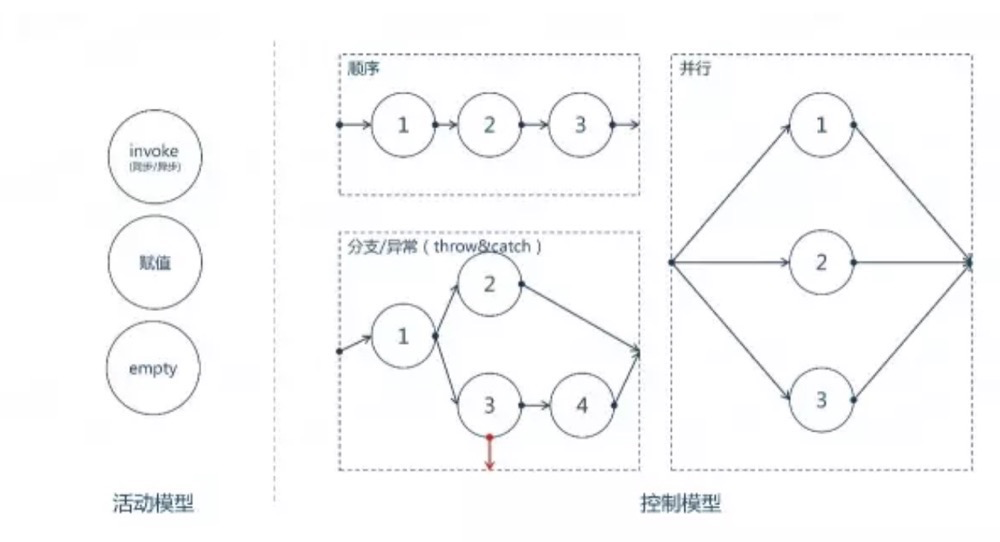

# 背景及现状

时下各流行app的首页基本都是多模块拼接而成，例如美团、天猫、淘宝首页等，其包含了频道区、banner、icon、商品、大促、品牌等，如果逐一通过多次网络调用多个接口去获取数据，加载速度及用户体验都十分不好；
一般的，都是由服务端统一将这些数据拼接而成一个接口输出给客户端，具体如下：

- 手写编排逻辑，以服务形式呈现

这种方式开发维护成本都会比较高，所以我们想引入一种方式来快速解决这个问题 --- 编排。

# 谈谈编排

## 是什么？

相对于传统架构，微服务架构下更需要通过各微服务之间的协作来实现一个完整的业务流程，可以说服务编排是微服务架构下的必备技能。

编排的几种模式

- Orchestration(编制)：面向可执行的流程：通过一个可执行的流程来协同内部及外部的服务交互。通过中心流程来控制总体的目标，涉及的操作，服务调用顺序。【红绿灯】

- Choreography(编排)：面向合作：通过消息的交互序列来控制各个部分资源的交互。参与交互的资源都是对等的，没有集中的控制。【环岛路】

- API网关：可以理解为Orchestration的一种，利用LAN的带宽，弥补internet的不足

编制初看起来好像没有编排自由，灵活。但是编排也有不完美的地方：

- 编排使一个业务流程会嵌入到多个服务中，维护会困难重重。
- 编排的对等特点，使得两端的服务强耦合，将表现为很难适应需求的变化。

在扩展性上和工程化上编制在一定程度上更优于编排，在一个业务域内编制更适用，而编排更适用跨业务域的流程。

## 包含什么

服务编排关键的点在于：

1. 流程：刻画出须表达的业务流程
2. 适配：参数的适配
3. 事务：一致性原则
4. 监控：日志全路径回放

【流程】

编排包含3个基本的活动模型（`赋值`、`invoke（调用）`、`空`）和5个基本的控制模型（`顺序`、`分支`、`异常抛出`、`异常捕获`、`并行`）。

`Notes`：

- invoke同步：超时处理、熔断降级
- invoke异步：上下文缓存、异步请求/响应关联

【适配】

一个编排服务（abcd）由a、b、c、d服务编排而成，每个服务都会有自己的出参入参。适配的过程就是从上下文中给入参赋值以及将出参的结果写入到上下文中。

实现方式-- 元数据着色

- metadata
- 数据字典

【事务】

编排系统须保证AP，在支付、下单等场景须满足最终一致性，通过补偿策略

# 业界实现

## Netflix Conductor

- JSON DSL：支持3+5模型，仅业务流程编排；多种[系统Task](https://netflix.github.io/conductor/configuration/systask/)
- Worker：具体的Worker由代码实现，worker默认长轮询1秒
- 工作流、并行
- 任务状态、历史；任务控制(中断、恢复、重启)
- client-service、dyno-queue、
- 监控

普遍用于netflix的内容获取、摄取和编码的各种流；更多的适用于长流程的编排

## [zeebe-io/zeebe](https://github.com/zeebe-io/zeebe)

[组件概述](https://blog.csdn.net/qq_30739519/article/details/89437516)

- Client：客户端是嵌入到应用程序（例如执行业务逻辑的微服务）中以连接到Zeebe集群的库
- Gateway：流量入口
- Broker：一个分布式工作流引擎，用于保持活动工作流实例的状态
- Exporter：在Zeebe中提供状态更改的事件流

支持的工作流类型

- Sequences：无依赖关系顺序处理
- Data Flow：上下文依赖型
- Data-based Conditions：条件判断
- Events：pub/sub模式
- Fork/Join Concurrency：并行执行任务，fork/join

## 其他

- [uber/cadence](https://github.com/uber/cadence)：分布式、伸缩、高可靠的异步执行业务逻辑，工具比较丰富，同时提供了可视化UI
- [ing-bank/baker](https://github.com/ing-bank/baker)：scala 开发的微服务调度框架
- [aws/setp functons](https://aws.amazon.com/cn/step-functions/)：aws的云服务

# 设计一个编排系统

（1）编排系统应该包含什么

1. 基本编排
   1. 3+5模型+超时及熔断
   2. 元数据着色
2. 辅助手段
   1. 流程图形化
   2. 监控手段

（2）设计

定位：编排Service仅负责基于数据源的业务流程编排，不干预数据编排；

- DSL：编排语法、熔断语法
- 任务可视化、历史等
- 监控