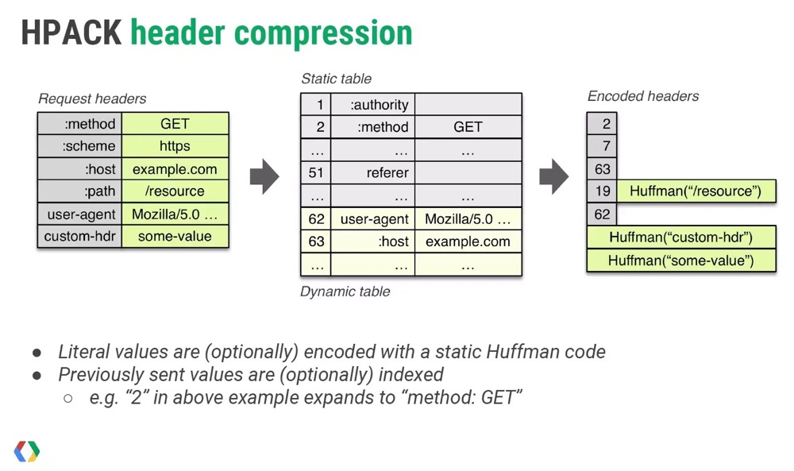

[toc]

# 1. 背景

在HTTP/1协议中，HTTP请求和响应都是由状态行、请求/响应header、body体三部分组成；一般来说，body体都会经过gzip压缩或本身传输的就是二进制数据，但状态行和header却没有经过压缩，直接是以纯文本传输。

在互联网日益发展的今天，大型网站中每个页面中产生的请求数越来越多(根据 [HTTP Archive](http://httparchive.org/trends.php) 的统计，当前平均每个页面都会产生上百个请求)，这些请求在header传输上消耗的流量越来越多，尤其是每次都需要传输一些固定的HTTP header头，例如method、UserAgent这些不会频繁变动的内容

为了解决这个header压缩的问题(当然还有HTTP1的其他问题，如连接无法同时处理多个请求等)，HTTP/2应运而生；HTTP/2 协议由两个 RFC 组成：一个是 [RFC 7540](https://httpwg.github.io/specs/rfc7540.html)，描述了 HTTP/2 协议本身；一个是 [RFC 7541](https://httpwg.github.io/specs/rfc7541.html)，描述了 HTTP/2 协议中使用的头部压缩技术。


# 2. 实现原理

HTTP/2的header压缩使用的是HPACK算法，其过程简述为：

- 消息发送端和消息接受端共同维护一份静态字典和一份动态字段
- 每次请求时，发送方根据字典的内容以及一些特定指定，编码压缩消息头部
- 接收方根据字典进行解码，并且根据指令来判断是否需要更新动态表


如下图所示



如上图所示，header压缩需要在支持HTTP/2的客户端和服务端之间（**使用HTTP/2要求头部名称必须小写**），图上的内容大致可以归纳为：

- 维护一份相同的静态字典（Static table），包含常见的头部名称，以及特别常见的头部名称和值的组合，还包含了状态行信息method、path、status等。（完整表格详见：[HPACK: Header Compression for HTTP/2](https://httpwg.org/specs/rfc7541.html#static.table.definition)）
- 维护一份相同的动态字典（Dynamic table），可以动态的添加内容，其作用域在同一个连接上（同一个连接的请求可以复用动态字典）
  - 动态表允许包含**重复的条目**，可能出现完全相同的键值对
  - 为了限制解码器的需求，动态表大小有严格限制
- 支持基于静态哈夫曼码表的哈夫曼编码（Huffman Coding）


由上面的描述可以得出，动态字典积累的越全，传输的数据量就会越少，header压缩的效果就会更好，所以在使用HTTP/2时最重要的一点就是**使用尽可能少的连接**，所以针对HTTP/2网站，不要合并资源，不要使用多域名。

在浏览器上，使用同一个连接的情况：

1. 同一域名
2. 不同域名（同时满足下面两个条件）
   1. 解析到同一IP
   2. 使用同一证书


## 2.1 索引地址空间

静态表和动态表一起组成一个索引地址空间，动态表的插入遵循FIFO，在头部插入，在尾部移除


header的字段在地址空间的存储主要有以下几种表示方法：

1. 直接用索引值来表示（例如2标识method: GET）
2. header的name使用索引值表示，header的value直接使用原有[字面](https://github.com/halfrost/Halfrost-Field/blob/master/contents/Protocol/HTTP:2_Header-Compression.md#4-header-field-representation)（编码的header字段可以表示为索引或字面）的值的八位字节序列或者使用静态哈夫曼编码标识


## 2.2 字段表示法

header字段的表示一共有两种：

1. 数字表示法
2. 字符串表示法


### 2.2.1 数字表示法

数字主要用来表示索引空间中的索引值，具体的规则如下：

1. 先用限定位数的前缀表示，如果范围足够那就直接表示（限定位数是指扣除动态表更新指令占用位数后剩余的长度）
2. 如果范围不够大，那么接下来每次增加8个字节来表示
3. 8个字节的最高位都作为标志位，表示是否要继续向下延续（解码的时候要用到）


举几个例子：

```
用4位前缀标识-0001（假设动态表更新指令需要使用4位前缀标识,具体的算法会在后面的情况4里面说明）

5：00010101
32: 00011111 00010001
```


### 2.2.2 字符串表示法

```
  0   1   2   3   4   5   6   7
+---+---+---+---+---+---+---+---+
| H |     Value Length (7+)     |
+---+---------------------------+
| Value String (Length octets)  |
+-------------------------------+
```

- **H**是一个标志位，表示该字符串的八位字节是否被哈夫曼编码过
- **String Length**:，表示用于编码的字节位数，具体的规则就是刚刚提到的7位前缀表示法
- **String Data**：字符串编码过的数据，如果h为0，则编码数据是字符串文字的原始八位字节；如果H是“1”，则编码数据是字符串文字的huffman编码。[huffman编码参见](https://httpwg.org/specs/rfc7541.html#huffman.code)

## 2.3 动态表更新指令以及表示

HTTP/2的header键值对更新指令有以下几种情况：

1. 整个header键值对都在字典中（限定位数=1，为第1位=1）
2. header名称在字典中，更新动态字典（限定位数=2，前两位=01）
3. header名称不在字典中，更新动态字典（限定位数=8，前八位=01000000）
4. header名称在字典中，不允许更新动态字典（限定位数=4，前四位=0001）
5. header名称不在字典中，不允许更新动态字典（限定位数=8，前八位=00010000）
6. 其他
   1. header名称在字典中，本次不允许更新动态字典（限定位数=4，前四位=0000）
   2. header名称不在字典中，本次不允许更新动态字典（限定位数=8，前八位=00000000）


不更新的情况大多是为了安全考虑，详见：[七. 安全注意事项](https://github.com/halfrost/Halfrost-Field/blob/master/contents/Protocol/HTTP:2_Header-Compression.md#1-探测动态表状态)


### 2.3.1 整个header键值对都在字典中

```
  0   1   2   3   4   5   6   7
+---+---+---+---+---+---+---+---+
| 1 |        Index (7+)         |
+---+---------------------------+
```

此时使用1个字节来表示header信息，其构成为：

- 第一位固定为1
- 之后7位存放键值对在静态或动态字典中的索引

例如索引值为2，则数据传输为10000010，在静态字典中查询可得***:method: GET***

### 2.3.2 header名称在字典中，更新动态字典

```
  0   1   2   3   4   5   6   7
+---+---+---+---+---+---+---+---+
| 0 | 1 |      Index (6+)       |
+---+---+-----------------------+
| H |     Value Length (7+)     |
+---+---------------------------+
| Value String (Length octets)  |
+-------------------------------+
```

此时需要使用2+N个字节来表示header信息，其构成为

1. 第一个字节
   1. 前两位固定为01
   2. 后6位存放键值对在静态或动态字典中的索引
2. 第二个字节
   1. H：0或1，是否使用哈夫曼编码
   2. 后7位标识value的占用的字节数
3. N个字节：value的实际值，如果使用了哈夫曼编码则需要将该值进行解码

**客户端或服务端在看到这种格式的键值对时，会将其完整的加入到动态字典中，后续传输时就会使用第一种情况**

### 2.3.3 header名称不在字典中，更新动态字典

```
  0   1   2   3   4   5   6   7
+---+---+---+---+---+---+---+---+
| 0 | 1 |           0           |
+---+---+-----------------------+
| H |     Name Length (7+)      |
+---+---------------------------+
|  Name String (Length octets)  |
+---+---------------------------+
| H |     Value Length (7+)     |
+---+---------------------------+
| Value String (Length octets)  |
+-------------------------------+
```

此时需要使用3+N+M个字节来表示header信息，其构成为：

1. 第一个字节
   1. 前两位固定为01
   2. 后6位存放键值对在静态或动态字典中的索引
2. 第二个字节
   1. H：0或1，是否使用[哈夫曼编码](https://httpwg.org/specs/rfc7541.html#huffman.code)
   2. 后7位标识header名称的占用的字节数N
3. N个字节：header名称的实际值，如果使用了哈夫曼编码则需要将该值进行解码
4. 第N+3个字节
   1. H：0或1，是否使用哈夫曼编码
   2. 后7位标识header的value的占用的字节数M
5. M个字节：value的实际值，如果使用了哈夫曼编码则需要将该值进行解码

**客户端或服务端在看到这种格式的键值对时，会将其完整的加入到动态字典中，后续传输时就会使用第一种情况**

### 2.3.4 header名称在字典中，不允许更新动态字典（什么时候使用这种情况？）

```
  0   1   2   3   4   5   6   7
+---+---+---+---+---+---+---+---+
| 0 | 0 | 0 | 1 |  Index (4+)   |
+---+---+-----------------------+
| H |     Value Length (7+)     |
+---+---------------------------+
| Value String (Length octets)  |
+-------------------------------+
```

此时需要3个字节来表示header信息，其构成为：

1. 第一个字节：
   1. 前四位固定为0001
   2. 后4位存放键值对在静态或动态字典中的索引
2. 第二个字节
   1. H：0或1，是否使用哈夫曼编码
   2. 后7位标识value的占用的字节数
3. N个字节：value的实际值，如果使用了哈夫曼编码则需要将该值进行解码

这里需要特别注意的是，这种情况的后4位索引不是直接转换为十进制，而是通过一种解码算法来表示；例如有如下值：

```
实际header值：cookie: v=47
编码值：00011111 00010001 10000100 11101111 00000011 01001110 11111111
```

第一个字节为00011111，并不代表头部名称的索引为 15（1111）。第一个字节去掉固定的 0001，只剩四位可用，将位数用 N 表示，它只能用来表示小于「2 ^ N - 1 = 15」的整数 I。对于 I，需要按照以下规则求值（RFC 7541 中的伪代码，[via](http://http2.github.io/http2-spec/compression.html#integer.representation)）：

```
if I < 2 ^ N - 1, return I         # I 小于 2 ^ N - 1 时，直接返回
else
    M = 0
    repeat
        B = next octet             # 让 B 等于下一个八位
        I = I + (B & 127) * 2 ^ M  # I = I + (B 低七位 * 2 ^ M)
        M = M + 7
    while B & 128 == 128           # B 最高位 = 1 时继续，否则返回 I
    return I
```

按照这个规则算出索引值为 32（00011111 00010001，15 + 17），代表 cookie。需要注意的是，协议中所有写成（N+）的数字，例如 Index (4+)、Name Length (7+)，都需要按照这个规则来编码和解码。

这种格式的头部键值对，不允许被添加到动态字典中（但可以使用哈夫曼编码）。对于一些非常敏感的头部，比如用来认证的 Cookie，这么做可以提高安全性。

### 2.3.5 header名称不在字典中，不允许更新动态字典

```
  0   1   2   3   4   5   6   7
+---+---+---+---+---+---+---+---+
| 0 | 0 | 0 | 1 |       0       |
+---+---+-----------------------+
| H |     Name Length (7+)      |
+---+---------------------------+
|  Name String (Length octets)  |
+---+---------------------------+
| H |     Value Length (7+)     |
+---+---------------------------+
| Value String (Length octets)  |
+-------------------------------+
```

此时需要使用3+N+M个字节来表示header信息，其构成为：

1. 第一个字节
   1. 前4位固定为0001
   2. 后4位固定为0
2. 第二个字节
   1. H：0或1，是否使用哈夫曼编码
   2. 后7位标识header名称的占用的字节数N
3. N个字节：header名称的实际值，如果使用了哈夫曼编码则需要将该值进行解码
4. 第N+3个字节
   1. H：0或1，是否使用哈夫曼编码
   2. 后7位标识header的value的占用的字节数M
5. M个字节：value的实际值，如果使用了哈夫曼编码则需要将该值进行解码

这种格式的头部键值对，也不允许被添加到动态字典中，只能使用哈夫曼编码来减少体积

### 2.3.6 其他

协议中还规定了4、5非常类似的另外两种格式：将4、5格式中的第一个字节第4位由1改为0即可；它表示**本次不更新动态字典**，而4、5表示**绝对不更新动态字典**。

# FYI

- [HTTP/2 头部压缩技术介绍](https://imququ.com/post/header-compression-in-http2.html)
- [详解 HTTP/2 头压缩算法 —— HPACK](https://halfrost.com/http2-header-compression/)
- [详解http-2头部压缩算法](https://segmentfault.com/a/1190000017011816)