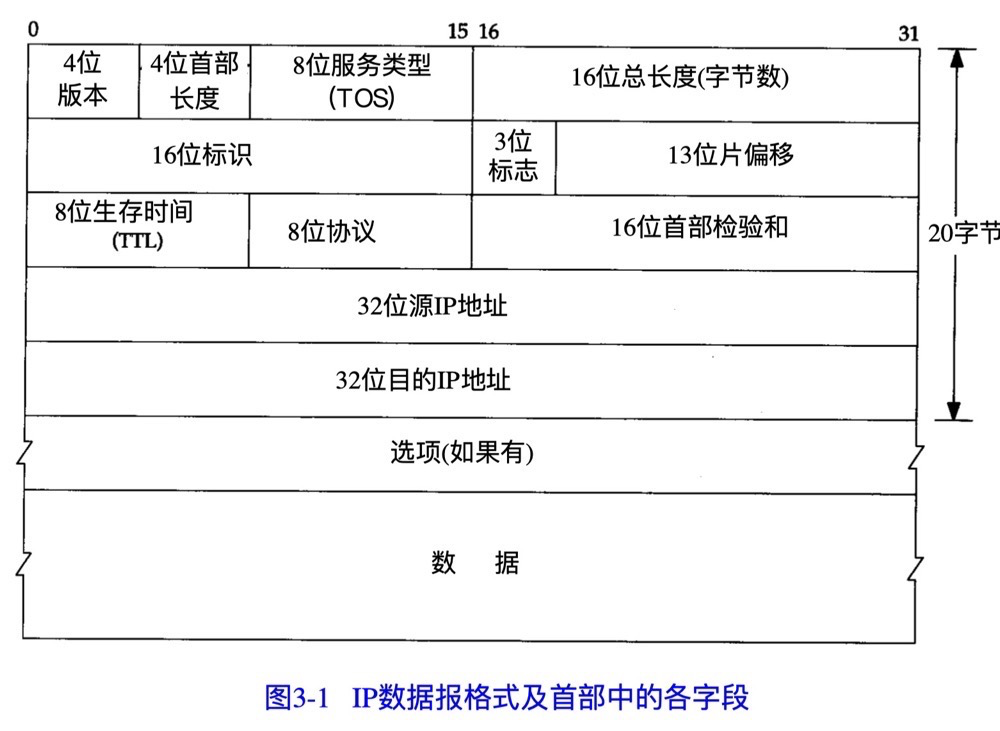

[toc]

# 特性

1. 不可靠
2. 无连接

# IP首部

1. `4位版本`：ipv4
2. `4位首部长度`：首部占32bit字的数目
3. `8位服务类型（TOS）`：一个 3 bit的优先权子字段（现在已被忽略），4 bit的TO S子字 段和1 bit未用位但必须置0。4 bit的TO S分别代表：最小时延、最大吞吐量、最高可靠性和最小费用
4. `16位总长度`：所以ip报数据最大长度为65535字节，但实际大多数链路层都会进行分片，主机一般也会要求不能接收超过576字节的数据。当然也有部分允许超过8192字节的数据（例如NFS等）
5. `16位标识`：标识主机发送的每一份数据报。每发送一份就会加1。`TODO 分片与重组`
6. `3位标志`： `TODO 分片与重组`
7. `13位片偏移`： `TODO 分片与重组`
8. `8位生存时间(TTL)`：数据报可以经过的最多路由数，一般为32或64；经过一次路由减1，为0时，数据报被丢弃，并发送ICMP报文通知源主机
9. `8位协议`：协议字段
10. `16位首部校验和`：对首部中每个`16bit`进行二进制反码求和;接收方收到数据报后，以同样的方式进行计算，并将值与数据报中的校验和进行比较，如果完全相等则成功，否则校验失败等丢弃

# IP路由

1. 搜索路由表：寻找能与目的IP和端口号完全匹配的表目，如果IP一致，则转发到端口；如果IP不一致，则寻找标为“默认”的条目(标识了下一站路由器)
2. 跳到下一个路由器：根据“默认”条目中，将数据报转发到下一站路由器