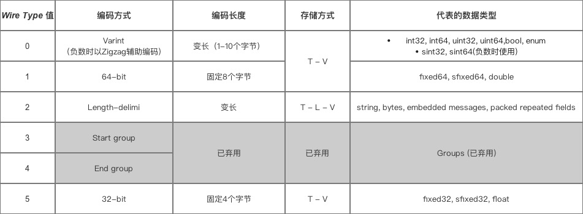
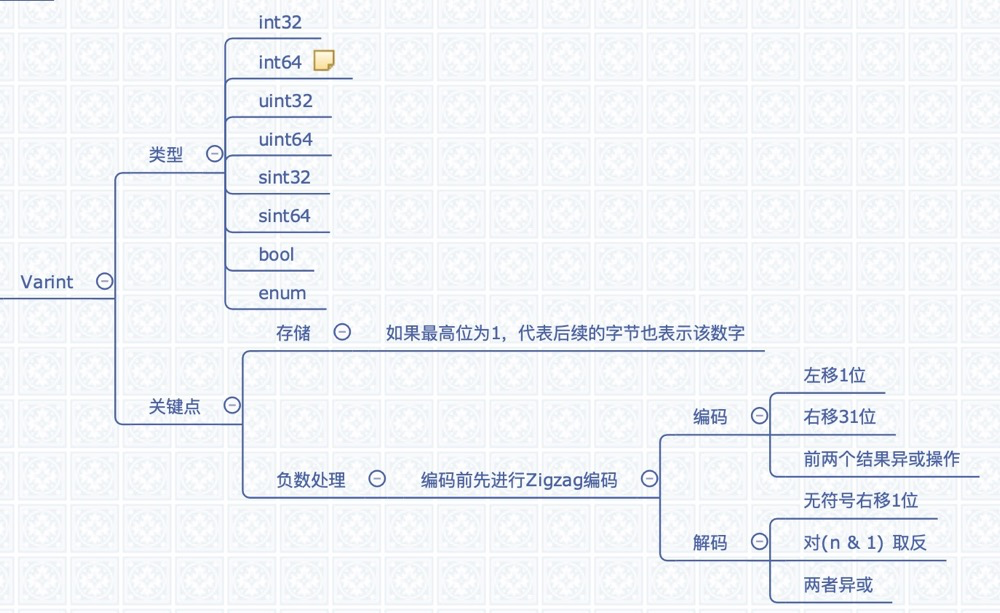

[TOC]

# 认识Protobuf
> Protocol buffers are a flexible, efficient, automated mechanism for serializing structured data – think XML, but smaller, faster, and simpler.

Protobuf是Google推出的一种轻量&高效的结构化数据存储格式，是一款跨平台、跨语言、可扩展的序列化结构数据的方法；可用作通信协议、数据存储,etc...

## 特性
【优点】
- 使用简单
- 跨平台、跨语言、可扩展性
- 维护成本低
- 向后兼容性好
- 加密性好：二进制不可读
- 性能好
    - 体积比XML小3倍
    - 序列化速度比XML快20倍
    - 传输速度快

【缺点】
- 自解释性差:二进制不可读
- 需预定义结构

## 适用场景
- 传输数据量大
- 网络环境不稳定

# 看个例子
```java
message Person {
  /** required and optional 
  *  1.required:必填
  *  2.optional:可选
  */
  // field_type field_name = field_number
  required string name = 1;
  required int32 id = 2;
}
```
【测试代码】
```java
@Test
public void testProtoBuf() {
    // encode bytes
    byte[] bytes = Person.newBuilder().setName("java").setId(1).build().toByteArray();
    System.out.println(Arrays.toString(bytes));
    
    // decode bytes
    for (byte b : bytes) {
        System.out.println(getBinString(b));
    }
}

private String getBinString(byte b) {
    return String.format("%8s", Integer.toBinaryString(b)).replace(' ', '0');
}
```

【生成的字节数组及二进制】
```java
// 字节数组
[10, 4, 106, 97, 118, 97, 16, 1]
// 二进制
00001010
00000100
01101010
01100001
01110110
01100001
00010000
00000001
```
下面我们通过上述二进制的输出了解下`protobuf`是怎么进行序列化的

# 序列化
`protobuf`序列化采用的`Tag-Length-Value`结构的存储方式
- Tag：通过一个字节(8位)来存储field_number(前5位)和field_type(后3位)
- Length:可选值，存储Value的长度，Length-delimited需要存储Length
- Value:对应字段值的二进制表示

重点介绍一下Tag里面field_type表示，其决定了value是怎么表示；
【Wire Type表】


通过Wire Type再来看上文的二进制表示
```java
# set name = "java"
# Tag:field_number=1,field_type=2
00001010
# Length:4
00000100
# Value:"java"
01101010
01100001
01110110
01100001

# set id = 1
# Tag:field_number=2,field_type=0
00010000
# Value:1
00000001
```

## Varint
Varint是一种特殊的整型，可变长的数字；其类型主要包含以下几个


它用一个或多个字节来表示一个数字，值越小的数字使用越少的字节数。这能减少用来表示数字的字节数。
```
如：
1. 对于 int32 类型的数字，一般需要 4个字节 表示； 若采用 Varint编码，对于很小的 int32 类型 数字，则可以用 1个字节 来表示 
2.虽然大的数字会需要 5 个 字节 来表示，但大多数情况下，消息都不会有很大的数字，所以采用 Varint方法总是可以用更少的字节数来表示数字
```
我们看一下写int32的源码
```java
private void writeVarint32(int n) {                   
  int idx = 0;  
  while (true) {  
    // 如果只有一个字节，直接中断
    if ((n & ~0x7F) == 0) {  
      i32buf[idx++] = (byte)n;  
      break;  
    } else {  
      // 取出字节串末7位,在最高位添加1构成一个字节
      i32buf[idx++] = (byte)((n & 0x7F) | 0x80);  
      // 无符号右移7位
      n >>>= 7;  
    }  
  }  
  trans_.write(i32buf, 0, idx); 
}   

```

从以上源码我们能得出
1. 如果最高位为1，表示后续的 字节 也是该数字的一部分
2. 如果是 0，表示这是最后一个字节，且剩余 7位 都用来表示数字 

因此：
- 小于 128 的数字 都可以用 1个字节 表示；
- 大于 128 的数字，比如 300，会用两个字节来表示：10101100 00000010

【负数的特殊处理】
我们知道，在二进制表示中，如果最高位为1，则代表该数为负数；当然`Protobuf`也很好的解决了这个问题，
```
`Protobuf`定义了 `sint32 / sint64` 类型表示负数，通过先采用 `Zigzag` 编码（将`有符号数`转换成`无符号数`），再采用 Varint编码，从而用于减少编码后的字节数 
```

【Zigzag】
Zigzag是一种变长的编码方式，使得绝对值小的数字都可以采用较少`字节`来表示；其编码解码过程为

- 编码过程，代码为`(n <<1) ^ (n >>31)`
    - 将n左移1位
    - 将n右移31位
    - 前两个结果异或操作
- 解码过程，代码为`(n >>> 1) ^ -(n & 1)`
    - 无符号右移1位
    - 对(n & 1) 取反
    - 两者异或


# FYI
- [Protocol Buffer 序列化原理大揭秘 - 为什么Protocol Buffer性能这么好？](https://blog.csdn.net/carson_ho/article/details/70568606)
- [Google Protocol Buffers 序列化算法分析](https://www.jianshu.com/p/926f6c2b6371)
- [Protocol Buffers
](https://developers.google.com/protocol-buffers/docs/overview)