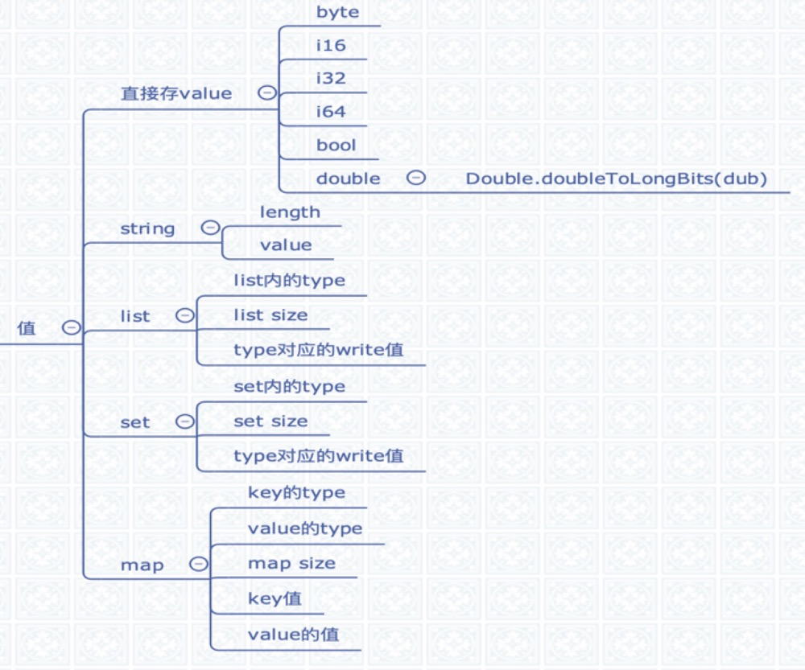

[TOC]
# 认识Thrift
> Thrift is an interface definition language and binary communication protocol[1] used for defining and creating services for numerous languages.

Thrift是2007年Facebook提交Apache基金会将Thrift作为一个开源项目，Facebook的初衷是为了解决facebook系统中各系统间大数据量的传 输通信以及系统之间语言环境不同需要跨平台的特性。

【Feature】
- interface description language
- 支持多语言：C++,C#,Cocoa,D,Delphi,Erlang,Haskell,Java,OCaml,Perl,PHP,Python,Ruby,Smalltalk
- namespaces
- thrift type
    - `Base Types`:bool,byte,i16,i32,i64,double,string
    - `Enum type`:枚举类型
    - `Special Types`:binary
    - `Structs`:自申明
    - `Containers`:list,set,map
    - `Exceptions`:等同于Structs，一般地，继承语言自带的异常体系，无缝集成
    - `Services`:接口声明，包含了方法声明
- asynchronous invocations
- service inheritance
- 向后兼容性：在原有Struct上添加字段不影响序列化结果

【Non-Feature】
- `structs inheritance`
- `polymorphism`:多态也不支持
- `overloading`:不支持重载
- `heterogeneous containers`：容器内只能支撑一种类型
- `Null return`:方法不能直接返回null

## Thrift基础架构 
Thrift是一个服务端和客户端的架构体系，个人理解Thrift是一个类似`XML+RPC+JAVA-to-IDL+Serialization Tools`的结合体，Thrift具有自己内部定义的传输协议规范（`TProtocol`）和传输数据标准（`TTransports`），通过IDL脚本对传输数据的数据结构（struct）和传输数据的业务逻辑（service）根据不同的运行环境快速的构建相应的代码。并且通过自己内部的序列化机制对传输的数据进行简化和压缩提高高并发、大型数据中数据交互的成本，下图描绘了Thrift的整体架构，分为6个部分：
1. 你的业务逻辑实现(You Code) 
2. 客户端和服务端对应的Service 
3. 执行读写操作的计算结果
4. TProtocol 
5. TTransports
6. 底层I/O通信


图 中前面3个部分是
(1).你通过Thrift脚本文件生成的代码，
(2).图中的褐色框部分是你根据生成代码构建的客户端和处理器的代码，
(3).图中红色的部分是根据 Thrift 文件生成代码实现数据的读写操作，即(2) 产生的计算结果。
从TProtocol下面3个部分是Thrift的传输体系和传输协议以及底层I/O通信，Thrift并且提供 堵塞、非阻塞，单线程、多线程的模式运行在服务器上，还可以配合服务器/容器一起运行，可以和现有JEE服务器/Web容器无缝的结合。

## Thrift的适用场景：
1. Thrift适用于程序对程 序静态的数据交换，需要先确定好他的数据结构，他是完全静态化的，当数据结构发生变化时，必须重新编辑IDL文件，代码生成，再编译载入的流程，跟其他IDL工具相比较可以视为是Thrift的弱项；
2. Thrift适用于搭建大型数据交换及存储的通用工具，对于大型系统中的内部数据传输相对于JSON和xml无论在性能、传输大小上有明显的优势。

# 一个简单的Thrift文件

```thrift
namespace java service.demo

struct Pair {
    // required表示必填，optional为可选
    1:required string key,
    2:required string value
    3:optional int id
}

// 定义一个接口
service PairService {
    // 接口声明的方法
    Pair getPair();
    
    Pair getPairById(1:required int id);
}
```

# Thrift的序列化
回到正题，我们重点讲一下Thrift的序列化实现；

Thrift可以让用户选择客户端与服务端之间传输通信协议的类别，常用协议有以下几种：
- `TBinaryProtocol` ——二进制编码格式进行传输
- `TCompactProtocol` ——高效率的、密集的二进制编码格式进行数据传输
- `TJSONProtocol` ——使用JSON的数据编码格式进行数据传输
- `TSimpleJSONProtocol`——只提供JSON只写的协议，适用于通过脚本语言解析

在传输协议上总体划分为文本 (text) 和二进制 (binary) 传输协议，为节约带宽，提高传输效率，一般情况下使用二进制类型的传输协议为多数，有时还会使用基于文本类型的协议，这需要根据项目 / 产品中的实际需求。

## TBinaryProtocol
`TBinaryProtocol`是Thrift中最常用的编码格式，其存储结构如下：
1. type：字段的数据类型，详见`thrift type`,各type对应的int数

2. id：字段number，thrift文件中定义的1,2,3,4,....(`ps:所以id在Thrift中很重要，如果运行过程中修改id，可能导致值获取不到`)
3. 值：字段对应的值，不同类型的值存储的方式不一致



【写入过程】
```
for(field : fields) {
	write(field -> type); // 对应TType
	write(field -> id);	 // 对应IDL中字段的id
	write(field -> value); //对应的值 
    write(TType.STOP)
}

//[string example] write string
(1)write string length
(2)write string value

例如存一个int age = 18，如下

8 // 数据类型为i32
0, 1 // 字段id为1
0, 0, 0, 18 // 字段id为1（age）的值，占4个字节

```

【读过程】
```java
public void read(org.apache.thrift.protocol.TProtocol iprot, Pair struct) {
　　// 读取结构结束标记
　　iprot.readStructBegin();
　　while (true) {
　　　　// 读取Field属性开始标记
　　　　schemeField = iprot.readFieldBegin();
       if (schemeField.type == org.apache.thrift.protocol.TType.STOP) {
       		break;	    
       }
　　　　// *) field标记包含 id + type, switch根据(id+type)来分配相关的值
　　　　switch (schemeField.id) {
　　　　　　case <id>: // <field_name>
               // 当前id对应的type =》 <thrift.TType.type>
　　　　　　　　if (schemeField.type == thrift.TType.<type>) {
　　　　　　　　　　struct.<field_name> = iprot.read<type>();
　　　　　　　　　　struct.set<field_name>IsSet(true);
　　　　　　　　}
　　　　}
　　　　// *) 读取Field属性结束标记
　　　　iprot.readFieldEnd();
　　}
　　// *) 读取结构体结束标记
　　iprot.readStructEnd();
}
```

# FYI

- [IBM 资料](http://www.ibm.com/developerworks/cn/java/j-lo-apachethrift/)
- [官网](https://thrift.apache.org/)
- [英文文档](http://jnb.ociweb.com/jnb/jnbJun2009.html?cm_mc_uid=48416746243614477238492&cm_mc_sid_50200000=1448360658)
- [Thrift: The Missing Guide](http://diwakergupta.github.io/thrift-missing-guide/)
- [Thrift的使用与优化](https://autumnrain-zgq.iteye.com/blog/1772943)
